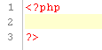

# Creating Projects and Files

<!--context:creating_and_uploading_a_project--><!--context:creating_projects_and_files-->

The purpose of this tutorial is to guide you through the steps involved in creating PHP Projects and files.

#### Contents:

 * [Creating a PHP Project](#creating-a-php-project)
 * [Creating a PHP File](#creating-a-php-file)

## Creating a PHP Project

<!--ref-start-->

To create a new PHP Project:

 1. Go to File Menu and select **New | PHP Project**.  -Or- In Project Explorer view, right-click and select **New | PHP Project**.
 2. The New Project wizard will open.  Enter a name for your new project into the Project Name field.
 3. Click **Finish** to complete the creation of your project.

<!--ref-end-->

The new project will be listed in Project Explorer view.

## Creating a PHP File

Creating a PHP file within PDT will automatically add PHP tags to the script, and allow you to fully utilize PDT 's PHP functionality.

<!--ref-start-->

To create a new PHP file within a project:

 1. In Project Explorer view, right-click your project and select **New | PHP File** -or- select your project and go to **File Menu | New | PHP File**.
 2. Enter the File Name and click **Finish**.  An editor window will appear with the following basic PHP code:  
    
 3. Add your code to the new file.
 4. Save the file by clicking the Save button  on the toolbar.
 5. To complete your project, create more PHP files by repeating steps 1-7.

<!--ref-end-->

Once you have created all your files, you can edit and debug, them. After taking all the necessary steps in order to obtain a server, you will be ready to deploy the project to the live server on which it will be running.

<!--links-start-->

#### Related Links:

 * [Basic Tutorials](000-index.md)
 * [Quick Start](../../008-getting_started/008-quick_start.md)
 * [Easy File Creation](../../024-tasks/016-file_creation/000-index.md)

<!--links-end-->
