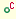
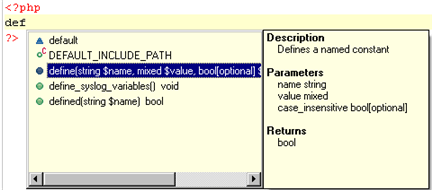
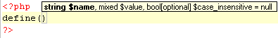
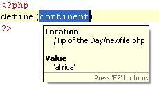

# Working with Content Assist

<!--context:working_with_code_assist-->

The purpose of this tutorial is to teach you how to use PDT 's Content Assist function in order to write code quickly, easily, and accurately.

#### Contents:

 * [Purpose and Usage](#purpose-and-usage)
 * [Activating Content Assist](#activating-content-assist)
 * [Making Content Assist Elements Available Within the Same Scope](#making-content-assist-elements-available-within-the-same-scope)
 * [Function Parameter Hints](#function-parameter-hints)
 * [Class Type Hints](#class-type-hints)
 * [Configuring Content Assist](#configuring-content-assist)

## Purpose and Usage

The Content Assist feature enables the selection and insertion of existing code elements to complete partially entered code.

A list of possible code elements appears in relevant locations within your files according to the context of your cursor, which you can then select to be automatically entered into your code.

Each type of code element will have a unique icon:

 1.  - Reserved PHP Words
 2.  - Functions
 3.  - Templates
 4.  - Classes
 5.  - Interfaces
 6.  - Traits
 7.  - Constants
 8.  - Variables (public)

Content Assist works with the following elements: PHP Classes, Functions, Variables, Constants, Keywords, Interfaces, Traits, Attributes, Values, Nested Functions, Names and Syntax, as well as all user defined Classes, Functions, and Constants.

<!--note-start-->

#### Note:

Content Assist works with both PHP and HTML.

<!--note-end-->

## Activating Content Assist

By default, the Content Assist options will be automatically displayed once the first few characters of the code have been entered.

<!--ref-start-->

The following procedure demonstrates using Content Assist:

 1. Create a new PHP File called 'File1'.
 2. On the line beneath the opening PHP tag, type "def".
 3.  Double-click the first define function from the Code Completion window -or- select it and press **Enter**. "define()" appears on the edit line.

<!--ref-end-->

<!--note-start-->

#### Note:

If the Content Assist window does not open automatically, place your cursor at the required location and press **Ctrl+Space**.  To enable the Content Assist window to open automatically, go to the [Content Assist Preferences page](../../032-reference/032-preferences/040-editor/008-code_assist.md), accessed from **Window | Preferences | PHP | Editor | Content Assist** and mark the 'Enable auto-activation' checkbox.

<!--note-end-->

## Function Parameter Hints

When entering a function call, a Function Parameter Hint box will be displayed detailing the types of parameters that should be entered within the parentheses of the function call.

<!--ref-start-->

**The following procedure demonstrates using the Function Parameter Hint feature**:

 1. Place your cursor between the parentheses of the above function call: "define()"
 2. Press **Ctrl+Shift+Space**.

A function parameter hint box will be displayed indicating the types of parameters that should be inserted between the parentheses.

<!--ref-end-->

## Making Content Assist Elements Available Within the Same Scope

### Added Code - Available within the same function and file

Elements within the same scope (e.g. within the same project, file or function) will be available for use with Content Assist.

Variables belonging to different scopes are not available to each other via Content Assist.

<!--ref-start-->

The following procedure demonstrates using Content Assist for inserting elements within the same function and file:

 1. Edit your PHP File ('File1') so that it contains the following code:

    <?php
    define('continent','africa');
    $control = '';
    $mail = 'int@eclipse.org';
    function media() {
        $music = '';
        $messenger = '';
        $                /*--------- Location_1*/
    }
    $                    /* ---------Location_2*/
    ?>

 1. Place the cursor at the "$" marked by "Location_1". This is within function "media".
 2. Type the letter "m". The Content Assist window will be displayed with the variables "$messenger" and "$music", which were defined within the function.  Note that the variable $mail (not within the scope of "media()" ) is not available.
 3. Next, place the cursor at the "$" marked by "Location_2".
 4. Type the letter "m". The Content Assist window will be displayed with the variable $mail, which is within the same file.  Note that media's variables - $music and $messenger  - are not within the function 'media' and so are not displayed.
 5. Select 'mail' from the Content Assist window to insert it into the script.

<!--ref-end-->

### Added Code - Available Within the Same Project

Code elements defined in one file are also available for use by other files within the same project.

<!--ref-start-->

The following steps demonstrate using Content Assist for inserting elements within the same project:

 1. Within the same project as "File1", create a new PHP file called "File2".
 2. On the line beneath the opening PHP tag, type "def" and press **Ctrl+Space** to activate Content Assist. Double-click one of the define options.
 3. Between the parentheses, type "cont" and press **Ctrl+Space** to activate Content Assist. The element 'continent', defined in "File1", will be available.
 4. Double-click 'continent' to enter it into your code.

When the element is highlighted, Content Assist displays the original location of the code element, its value ('africa') and all other information available.

<!--ref-end-->

## Class Type Hints

By using a comment you can assign a variable its exact class value. This assignment will affect the content assist of this variable accordingly.

<!--ref-start-->

**To see and trial this feature:**

 1. Create a new PHP file with the following code:

    <?php
    function getClass() {
        return new Test();
    }
    class Test {
        function printValues($a, $b) {
            echo "Values: $a, $b";
        }
    }
    $myVar = getClass();
    $myVar->
    ?>

 1. Place your cursor after  '$myVar->' (on the line above the closing PHP tag) and press **Ctrl+Space** to activate Content Assist. Content Assist will open with the function defined in 'Test' class (printValues($a, $b)). Double click it to enter it into your code.

<!--ref-end-->

## Configuring Content Assist

Content Assist options can be configured through the [Content Assist Preferences page](../../032-reference/032-preferences/040-editor/008-code_assist.md), accessible from **Window | Preferences | PHP | Editor | Content Assist**.

<!--links-start-->

#### Related Links

 * [Content Assist](../../016-concepts/016-code_assist_concept.md)
 * [Using Content Assist](../../024-tasks/024-using_code_assist.md)
 * [Content Assist Preferences](../../032-reference/032-preferences/040-editor/008-code_assist.md)
 * [Basic Tutorials](000-index.md)[Hover Support](../../016-concepts/072-hover_support.md)
 * [Commenting PHP DocBlocks](../../024-tasks/128-commenting_php_docblocks.md)

<!--links-end-->
