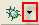
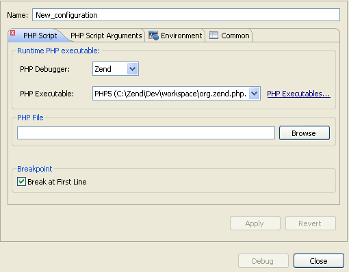
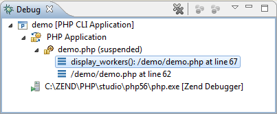
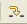
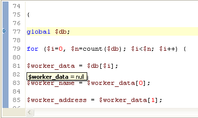
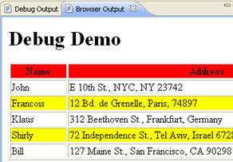
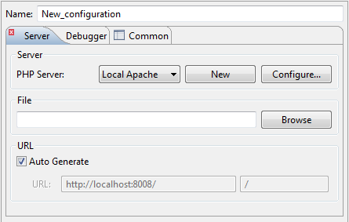
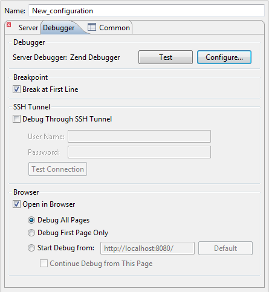
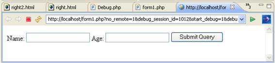
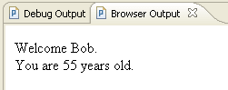

# Working with the Debugger

<!--context:working_with_the_debugger-->

The purpose of this tutorial is to teach you how to debug files and applications both remotely and locally in order to gain maximum efficiency and accuracy from your files and projects.

#### Contents:

 * [Purpose and Usage](#purpose-and-usage)
 * [Debugging Local PHP Files (PHP CLI Application)](#debugging-local-php-files-php-cli-application)
 * [Debugging PHP Web Applications (PHP Web Application)](#debugging-php-web-applications-php-web-application)

## Purpose and Usage

PDT 's Debugging feature can detect and diagnose errors in PHP code situated locally or on remote servers. The debugger allows you to control the execution of your program by setting breakpoints, suspending launched programs, stepping through your code, and examining the contents of variables.

Debugging should be used at stages where your scripts and applications are formed sufficiently to be tried and tested.

PDT includes several types of debugging:

 * Locally Debugging PHP Scripts - Debugging PHP files using an internal PHP Executable debugger.
 * Debugging PHP Web Pages - Debugging files, applications and projects on your server

## Debugging Local PHP Files (PHP CLI Application)

PHP files (PHP CLI Application) on your workspace can be debugged locally using PDT's internal debugger.

<!--note-start-->

#### Note:

Your server must be running the Xdebug or Zend Debugger in order for remote debugging capabilities to function.

<!--note-end-->

Debugging a PHP File Locally

Files can be debugged using PDT 's internal debugger.

<!--ref-start-->

This procedure demonstrates how to debug a file using the internal debugger or your server's debugger:

 1\. Inside a PHP project, [create a PHP file](../../024-tasks/016-file_creation/008-creating_a_php_file_within_a_project.md), called "debug", and copy-paste the example code into it. ( [Click here to see the code](resources/debugger_code_.htm) .)
 
 2\. Set a breakpoint at line 103 by double-clicking the marker bar to the left of the editor window.A blue ball will appear.
 
 3\. Save the file.
 
 4\. Click the arrow next to the debug button  on the toolbar and select **Debug Configurations...** -or- select **Run | Debug Configurations** from the main menu -or- right-click the file in Project Explorer view and select **Debug Configurations....**  A Debug dialog will appear.
 
 5\. Double-click the PHP CLI Application option to create a new debug configuration.

 6\. Enter a name for the new configuration.
 
 7\. To debug the file using your PHP Executable debugger, select the appropriate option in the **Runtime PHP** category. If no PHP Executables are available, click the **Installed PHPs** button and add a PHP Executable in the [PHP Executable Preferences](../../032-reference/032-preferences/056-php_executables/000-index.md) page.
 
 8\. Under PHP File, click **Browse** and select the "debug" file.
 
 9\. Ensure that the 'Break at First Line' Breakpoint checkbox is selected.
 
 10\. Click **Apply** and then **Debug**.
 
 11\. Click **Yes** if asked whether to open the PHP Debug Perspective.
 
 12\. A number of views will open with information about your script.
 
 13\. The Debug View is where the debug stack trace is displayed and the debugging process can be monitored and controlled. 

 
 
 14\. The debugging process will currently have stopped where your first `<?php label appears.`
 
 15\. Click the Resume icon  to continue to the breakpoint.
 
 16\. Click Step Into . The Debugger goes into the function defined in line 103 and advances to line 77.
 
 17\. The Variable view will now display various information about the relevant variables and parameters through which the function was reached.
 
 18\. In the editor window, place and hold the cursor over $worker\_name, $worker\_address, and $worker\_phone. A tooltip appears displaying the variable values.

 
 19\. Click Step Return.  The cursor returns to line 103.  The Debug Output view will display the HTML output created up until the breakpoint, while the Browser Output view will show the current output to a browser.
 
 20\. In the Debug view, click Resume   until the debugging process is terminated.  Notice that as the debugging process progresses, the Debug Output and Browser Output displays are updated.

 
 21\. The console view will display any errors or warnings about your script. In this case, it will display a Notice about an undefined variable on line 105.
 
 22\. Click on the PHP Perspective icon to return to normal editing mode.
 
 23\. To run the debugging process again, click the arrow next to the debug icon  on the toolbar and select your configuration -or- select **Debug Configurations...** and double-click your configuration from the "Debug" dialog.  Clicking the debug icon will debug the last executed launch configuration.

<!--ref-end-->

<!--note-start-->

#### Note:

Your server must be running the Xdebug or Zend Debugger in order for remote debugging  capabilities to function.

<!--note-end-->

## Debugging PHP Web Applications (PHP Web Application)

PDT also allows you to debug applications, projects or files that are already on the server.

<!--note-start-->

#### Note:

Your server must be running the Xdebug or Zend Debugger in order for remote debugging  capabilities to function.

<!--note-end-->

<!--ref-start-->

This procedure demonstrates how to debug applications on a server:

 1\. Inside a PHP project, [create a new PHP file](../../024-tasks/016-file_creation/008-creating_a_php_file_within_a_project.md), called "form1", with the following code:

    <html>
    <body>
    <form action="welcome.php" method="post">
    Name: <input type="text" name="name" />
    Age: <input type="text" name="age" />
    <input type="submit" />
    </form>
    </body>
    </html>

 2\. Create a second PHP file, called "welcome", with the following code:

    <html>
    <body>
    Welcome <?php echo $_POST["name"]; ?>. 
    You are <?php echo $_POST["age"]; ?> years old.
    </body>
    </html>

 3\. Save both files and copy them to your server.
 
 4\. Click the arrow next to the debug button   on the toolbar and select Debug Configurations... -or- right-click the file in Project explorer or within the file's editor window and select **Debug as | Debug Configurations....**  A Debug dialog will appear.
 
 5\. Double-click on the PHP Web Application option to create a new debug configuration.
 
 6\. Enter a name for the new configuration.
 
 7\. Select the Debugger from the Server Debugger drop-down list.
 
 8\. Select your server from the drop-down list.  If you have not configured a server, click the **New** button to open a wizard for creating new PHP server..
 
 9\. Under the File/Project category, click **Browse** and select the "form1" file. This will be the file from which the debugger will start debugging (the 'debug target'.)
 
 10\. Ensure that the URL pointing to the file location is correct.  If this is not correct, unmark the Auto Generate checkbox and manually change the URL.

 11\. Click **Apply** and then **Debug**.
 
 12\. Click **Yes** when asked whether to open the PHP Debug Perspective.
 
 13\. The Debug Perspective will open with several views relevant to the debugging process (See '[PHP Debug Perspective](../../032-reference/008-php_perspectives_and_views/016-php_debug_perspective/000-index.md)' for more information on the different views.)
 
 14\. In the editor view, you will see the code for the "form1" file.
 
 15\. In the Debug view, click **Resume** to resume the debugging process.
 
 16\. The browser output will display a form asking you to enter your Name and Age.
 
 17\. Select the browser view (tabbed with the editor window). This will display the output of your script in a browser in 'real time'.  Note that this is different from the Browser Output window.
 
 18\. In the browser view, enter your Name and Age and click **Submit Query**.

 19\. Another editor tab will open, with the script from the welcome.php file.
 
 20\. In the Debug view, click **Resume** to resume the debugging process.
 
 21\. The browser output and browser views will display the final result of your application:  `Welcome [Name].  You are [Age] years old.`

 22\. The debugging process will have terminated.
 
 23\. Click on the PHP Perspective icon to return to normal editing mode.
 
 24\. To run the debugging process again, click the arrow next to the debug icon  on the toolbar and select your debugging configuration.

<!--ref-end-->

<!--links-start-->

#### Related Links:

 * [Debugging](../../024-tasks/152-debugging/000-index.md)
 * [Using the Debugger](../../024-tasks/152-debugging/000-index.md)
 * [Debugging a PHP Web Page](../../024-tasks/152-debugging/032-debugging_a_php_web_page.md)
 * [Debug Preferences](../../032-reference/032-preferences/032-debug/000-index.md)
 * [Running and Analyzing Debugger Results](../../024-tasks/152-debugging/040-analyzing_debugger_results.md)

<!--links-end-->
