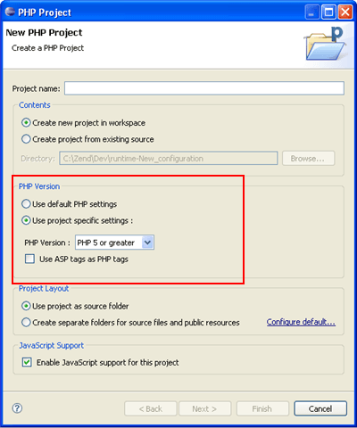
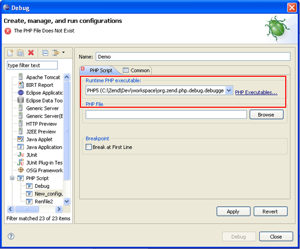

# PHP Version Support

<!--context:php_support-->

PDT supports PHP versions 5.1/5.2/5.3/5.4/5.5/5.6/7.0/7.1/7.2/7.3/7.4

PHP version settings affect:

 * The elements displayed in the [PHP Functions view](../032-reference/008-php_perspectives_and_views/024-php_additional_views/008-php_functions_view.md).
 * The options available in [Content Assist](016-code_assist_concept.md).
 * Debugging functionality.

PHP version settings can be configured from the following places:

 * PHP Executables can be added and edited from the [PHP Executables Preferences](../032-reference/032-preferences/056-php_executables/000-index.md) page.
 * The default PHP executable used for new projects can be set in the [PHP Interpreter Preferences](../032-reference/032-preferences/064-php_interpreter.md) page. Through this page you can also set the PHP version for specific projects.  In addition, you can select which PHP Version should be used when creating a new PHP project by marking the Enable Project Settings checkbox in the New PHP Project dialog.

 

 * The default PHP executable used with the debugger can be set in the [Debugging Preferences](../032-reference/032-preferences/032-debug/000-index.md) page, accessed from **Window | Preferences | PHP | Debug**. Through this page you can also set the PHP executable used to debug specific projects.  In addition, you can also configure the PHP executable used for each Debug  session in the Debug configuration screen.

<!--note-start-->

#### Note:

In order to minimize errors, the PHP Executable used for debugging should match the PHP version used for the project.

<!--note-end-->

<!--links-start-->

#### Related Links:

 * [PHP Interpreter Preferences](../032-reference/032-preferences/064-php_interpreter.md)
 * [PHP Executables Preferences](../032-reference/032-preferences/056-php_executables/000-index.md)
 * [Debugging](../024-tasks/152-debugging/000-index.md)

<!--links-end-->
