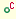
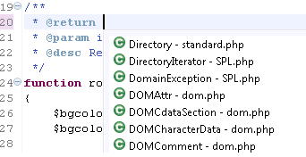
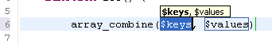
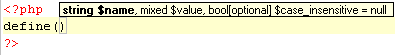
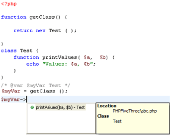
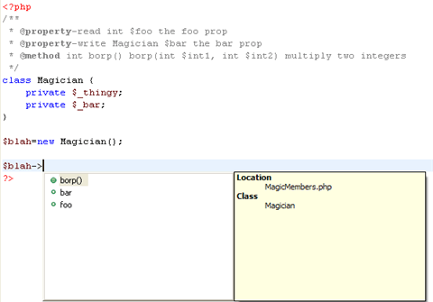
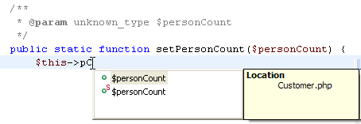

# Content Assist

<!--context:code_assist_concept-->

The Content Assist feature enables the selection and insertion of existing code elements to complete partially entered code.

A list of possible code elements is displayed in relevant locations within your files according to the context of your cursor, which you can then select to be automatically entered into your code.

Each type of code element will have a unique icon. See [PHP Icons](../032-reference/048-php_icons.md) for a description of each of the icons.

<table>
<tr><td></td>
<td>Reserved PHP Words</td></tr>

<tr><td></td>
<td>Functions</td></tr>

<tr><td></td>
<td>Templates</td></tr>

<tr><td></td>
<td>Classes</td></tr>

<tr><td></td>
<td>Interfaces</td></tr>

<tr><td></td>
<td>Constants</td></tr>

<tr><td></td>
<td>Variables (public)</td></tr>

<tr><td></td>
<td>PHP File Include Call</td></tr>

<tr><td></td>
<td>Namespaces (PHP 5.3)</td></tr>

<tr><td></td>
<td>Packages</td></tr>
</table>

Content Assist works with the following elements: PHP Classes, Functions, Variables, Constants, Keywords, Interfaces, attributes, values, nested functions, names, syntax and include calls, as well as all user defined Classes, Functions and Constants.

### Content Assist in PHPDocBlock

Content Assist provides proposals for the PHPDoc tags:

 * `@return` - A type description.
 * `@see` - Documents an association to another element.
 * `@throws` - Documents an exception thrown by a method.

#### Example:

### Templated Content Assist

Applying Content Assist proposals to the editor creates a templated expression that provides argument completion according to the declaration of the method. Templated Content Assist helps you edit your method parameters quicker.

#### Example:

### Using elements within the same scope

#### Examples:

 * Variables within a function will be added to the Content Assist list when the cursor is within that function.
 * Elements defined within one file will be available in the Content Assist menu in other files within the same project.

### FunctionParameter Hints

When entering a function call, a Function Parameter Hint box will be displayed detailing the types of parameters which should be entered within the parentheses of the function call.

#### Example:

If the Function Parameter Hint box is not displayed automatically, place your cursor between the parentheses and press **Ctrl+Shift+Space**.

### Class Type Hints

By using a comment you can assign a variable its exact class value. This assignment will affect the content assist of this variable accordingly.

#### Example:

<!--note-start-->

#### Note:

Without the comment, content assist will not be available for the function.

<!--note-end-->

By using a comment you can assign a variable its exact class value. This assignment will affect the content assist of this variable accordingly.

To assign a variable its class value using a comment:

1. Create your function and assign variables to it.
2. Enter a comment in the form:

    /* @var $"new variable" "Class name" */

### Content Assist for Magic Members

PDT supports Content Assist options for 'magic members'. These are properties and methods which were declared using the @property or @method tags within [PHP DocBlock comments](../016-concepts/064-commenting_code/008-phpdoc_comments.md) rather than in the PHP script itself.

See [http://manual.phpdoc.org/HTMLSmartyConverter/PHP/phpDocumentor/tutorial_tags.property.pkg.html](http://manual.phpdoc.org/htmlsmartyconverter/php/phpdocumentor/tutorial_tags.property.pkg.html) for more information on magic members.

#### Example:

### Camel Case Matches

Content Assist supports camel case matches when entering code, which displays Content Assist options based on an element's initials.

#### Example:

<!--note-start-->

#### Note:

Camel Case matching is case sensitive.

<!--note-end-->

## Configuring Content Assist

To configure PHP Content Assist options, go to the [Content Assist Preferences](../032-reference/032-preferences/040-editor/008-code_assist.md) page, accessible from **Window | Preferences | PHP | Editor | Content Assist**.

To configure JavaScript Content Assist options, go to the JavaScript Content Assist Preferences page, accessible from **Window | Preferences | Web | JavaScript | Editor | Content Assist**.

<!--links-start-->

#### Related Links:

 * [Working with Content Assist](../008-getting_started/016-basic_tutorial/016-working_with_code_assist.md)
 * [Using ContentAssist](../024-tasks/024-using_code_assist.md)
 * [Content Assist Preferences](../032-reference/032-preferences/040-editor/008-code_assist.md)
 * [Hover Support](072-hover_support.md)
 * [Commenting PHP DocBlocks](../024-tasks/128-commenting_php_docblocks.md)
 * [Using Templates](../024-tasks/032-using_templates.md)

<!--links-end-->
