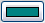
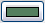
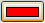
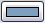
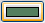
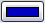
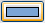

# Syntax Coloring

<!--context:syntax_highlighting-->

PDT can automatically apply different colors and font attributes to different PHP syntax elements in order for your scripts to be more easily navigable and to help you find relevant sections quickly and easily. With the Syntax Coloring Rules you can set the foreground color, background color and font type for a range of different elements in your code through the Syntax Coloring Preferences page. This allows for a quick assessment of your code with the different elements individually visible, making errors visually distinct and easier to detect.

Completing the relevant element will cause the required color and font settings to be applied to it.

---

 The table below goes into further detail about the elements available for Syntax Coloring rules and their default settings.

 <table>     <tr><th>Element Name</th>
 <th>Element Description</th>
 <th>Default Foreground Color</th>
 <th>Default Font</th></tr>
 <tr><td>Classes</td>
 <td>A user defined type (class or interface).</td>
 <td></td>
 <td></td></tr>
 <tr><td>Constants</td>
 <td>A variable with a value that cannot be altered during execution.</td>
 <td></td>
 <td><i>Italic</i></td></tr>

<tr><td>Deprecated members</td>

<td>An unused member which still appears while transitioning to
new members.</td>

<td>_</td>
 <td>Strikethrough</td></tr>
 <tr><td>Fields</td>
 <td>A reference to a class variable</td>
 <td></td>
 <td></td></tr>
 <tr><td>Functions</td>
 <td>A reference to a function</td>
 <td></td>
 <td></td></tr>
 <tr><td>Heredoc</td>
 <td>A Heredoc block representation of a string value.</td>
 <td></td>
 <td></td></tr>
 <tr><td>Internal classes</td>
 <td>A Type that was declared by PHP.</td>
 <td></td>
 <td></td></tr>
 <tr><td>Internal constants</td>
 <td>A constant that was declared by PHP.</td>
 <td></td>
 <td><i><b>Bold and Italic</b></i></td></tr>

<tr><td>Internal functions</td>

<td>A function that was declared by PHP.</td>

<td>_</td>
 <td></td></tr>
 <tr><td>Keyword</td>
 <td>A keyword that was declared by PHP.</td>
 <td></td>
 <td><b>Bold</b></td></tr>
 <tr><td>Methods</td>
 <td>A reference to a method</td>
 <td></td>
 <td></td></tr>
 <tr><td>Multi-line comment</td>
 <td>A comment that spans more than one line. ("* */")</td>
 <td></td>
 <td></td></tr>
 <tr><td>Normal</td>
 <td>Any section that does not have any specific description that applies to it.</td>
 <td></td>
 <td></td></tr>
 <tr><td>Number</td>
 <td>A number.</td>
 <td></td>
 <td></td></tr>
 <tr><td>Parameter variables</td>
 <td>A variable used in a method which refers to arguments in the method.</td>
 <td></td>
 <td><u>Underline</u></td></tr>
 <tr><td>PHP tags</td>
 <td>The PHP start and end tag (&lt;?php, ?&gt;).</td>
 <td></td>
 <td></td></tr>
 <tr><td>PHPDoc</td>
 <td>A standard for commenting PHP which allows you to insert annotations in your code.</td>
 <td></td>
 <td><b>Bold</b></td></tr>
 <tr><td>PHPDoc comment</td>
 <td>A readable annotation inserted into your code.</td>
 <td></td>
 <td></td></tr>
 <tr><td>Single-line comment</td>
 <td>A comment that spans a single line.</td>
 <td></td>
 <td></td></tr>
 <tr><td>Static fields</td>
 <td>A reference to a static field</td>
 <td></td>
 <td><i>Italic</i></td></tr>

<tr><td>Static methods</td>

<td>A reference to a static method</td>

<td>_</td>
 <td><i>Italic</i></td></tr>

<tr><td>String</td>

<td>A sequence of characters selected from a set, which represent
a string of data values.</td>

<td></td>

<td></td></tr>

<tr><td>Superglobal variables</td>

<td>A reference to Superglobal variables such as $_GLOBALS</td>

<td></td>

<td><b>Bold</b></td></tr>

<tr><td>Task tag</td>

<td>A reference to reminders of actions, work to do, or any other
action required.</td>

<td></td>

<td><b>Bold</b></td></tr>

<tr><td>Variable</td>

<td>A reference to a variable.</td>

<td></td>

<td></td></tr>

</table>

<!--note-start-->

#### Note:

All elements have a default Background of white. The color and font settings can be configured from the [Syntax Coloring preferences](../032-reference/032-preferences/040-editor/048-syntax_coloring.md) page, accessed from **Window | Preferences | PHP | Editor | Syntax Coloring**.

<!--note-end-->

<!--links-start-->

#### Related Links:

 * [Syntax Coloring preferences](../032-reference/032-preferences/040-editor/048-syntax_coloring.md)
 
<!--links-end-->
