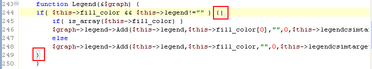

# Matching Brackets

<!--context:matching_brackets-->

PDT can help you to easily navigate through your script by finding brackets' matching pairs.

To see a bracket's pair, click to the right of the bracket. Its matching pair will be highlighted.

To jump to the matching bracket, press **Ctrl+Shift+P**.

<!--links-start-->

#### Related Links:

 * [Navigate Menu](../032-reference/016-menus/040-navigate.md)

<!--links-end-->
