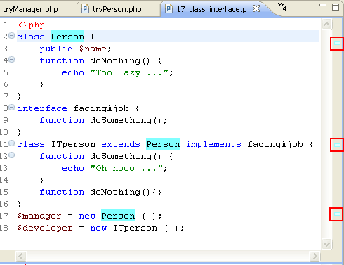

# Mark Occurrences

<!--context:mark_occurrences-->

The Mark Occurrences feature enables you to see where an element is referenced by simply clicking on the element in the editor.

When the Mark Occurrences feature is enabled, all occurrences of the element within the active file will be highlighted, and indicators will be displayed in the annotations bar (to the right of the editor).

In addition, hovering over the element will cause a tooltip to be displayed with the location of all references of the element, including occurrences of the element in other files.

Occurrences can be of 2 types - “Write Occurrence” (for occurrences that are in a write mode) or “Read Occurrence” (for occurrences that are in a read mode). These will be highlighted in different colors according to the setting configured for PHP elements 'read' and 'write' occurrences in the [Annotations preferences page](PLUGINS_ROOT/org.eclipse.platform.doc.user/reference/ref-22.htm) (**Window | Preferences | General | Editors | Text Editors | Preferences**). Here you can also configure the indicators used in the vertical ruler/marker bar (to the left of the editor) and the annnotations bar (to the right of the editor).

The types of elements whose occurrences will be highlighted can be configured in the [Mark Occurrences preferences page](../032-reference/032-preferences/040-editor/032-mark_occurences.md) (**Window | Preferences | PHP | Editor | Mark Occurrences**).

By default, the following types of elements are marked:

 * Method Exit - Exit points (throws / return / end of flow) of a method will be marked
 * Break / Continue - Scope (for, foreach, while, do-while or switch structure) of a break / continue statement will be marked
 * Local variables
 * Global variables
 * Parameters
 * Functions
 * Methods
 * Fields
 * Class Constants
 * Constants (defined)
 * Class/Interface
 * HTML Tags

<!--links-start-->

#### Related Links:

 * [Using Mark Occurrences](../024-tasks/112-using_mark_occurrences.md)
 * [Mark Occurrences Preferences](../032-reference/032-preferences/040-editor/032-mark_occurences.md)
 
<!--links-end-->
