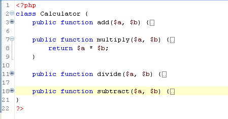

# Code Folding

<!--context:code_folding-->

Code Folding collapses or "folds" the display of a block of code. The editor will then display only the first line of code instead of the entire block. This reduces visual clutter by enabling users to selectively hide and display complicated text while still viewing those subsections of the text that are relevant.

Cold Folding is applied by default for functions and PHPDocBlocks. You can configure which of these are folded by default through the [Folding preferences dialog](../032-reference/032-preferences/040-editor/016-folding.md).

Folded code has a plus sign `[+]` on the vertical marker bar to the left of the Editor. Clicking this sign will expand the block of code.

Opened, unfolded code has a minus sign `[-]` on the vertical marker bar to the left of the Editor. Clicking this sign will fold the block of code.

See the [Using Code Folding](../024-tasks/056-using_code_folding.md) topic for more information.

<!--links-start-->

#### Related Links:

 * [Code Folding Preferences](../032-reference/032-preferences/040-editor/016-folding.md)
 * [Using Code Folding](../024-tasks/056-using_code_folding.md)

<!--links-end-->
