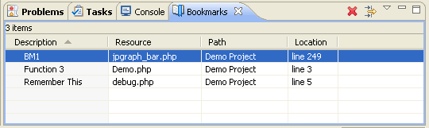

# Bookmarks

<!--context:bookmarks-->

Bookmarks can be used as placeholders within your scripts to allow easy navigation to pre-defined places within your scripts and resources.

Bookmarks are indicated by a bookmark icon  in the vertical marker bar to the left of the editor.

Bookmarks are displayed in the Bookmarks view, which can be opened by going to **Window | Show View | Bookmarks**.

For more on bookmarks, see the [Bookmarks](PLUGINS_ROOT/org.eclipse.platform.doc.user/concepts/cbookmrk.htm)  topic in the Workbench User Guide.

<!--note-start-->

#### Note:

Additional user guides can be accessed from inside PDT by going to **Help | Help Contents**, or from the Eclipse Online Documentation site ([http://help.eclipse.org/luna/index.jsp](http://help.eclipse.org/luna/index.jsp)).

<!--note-end-->

<!--links-start-->

#### Related Links:

 * [Automatic Completion](../../016-concepts/032-automatic_insertion.md)
 * [Hover Support](../../016-concepts/072-hover_support.md)

<!--links-end-->
