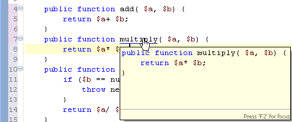

# Hover Support

<!--context:hover_support-->

Hovering over an element will cause a tooltip to appear with information about that element, containing the location of its declaration and any additional information (description, parameters, etc.) contained in the element's relevant [PHPdoc comment](../016-concepts/064-commenting_code/008-phpdoc_comments.md):

Hover information also includes other information such as overrides and returns for methods, types, and other elements:

Holding down **Ctrl** while hovering over an element will also show you everything contained within that element:

When hovering, press **F2** for the Hover tooltip to come into focus. This ensures that it is displayed even when not hovering and enables you to select the text from within it.

Clicking on an element while hovering will take you to that element's declaration. See [Using Smart Goto Source](../024-tasks/088-using_smart_goto_source.md) for more information.

### Configuring Hover Preferences

To configure your hover settings, go to the [Hover Preferences page](../032-reference/032-preferences/040-editor/024-hovers.md), accessible by going to **Window | Preferences | PHP | Editor | Hovers**.

<!--links-start-->

#### Related Links:

 * [Using Smart Goto Source](../024-tasks/088-using_smart_goto_source.md)
 * [Hover Preferences](../032-reference/032-preferences/040-editor/024-hovers.md)

<!--links-end-->
