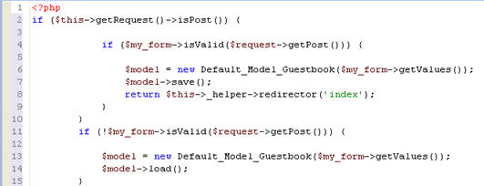
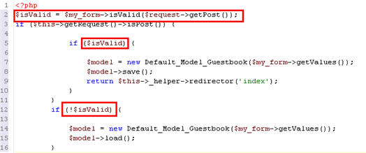

# Refactoring

<!--context:refactoring-->

The Refactoring feature allows you to:

* [Rename](../024-tasks/116-using_refactoring/008-renaming_files.md) and [move](../024-tasks/116-using_refactoring/024-moving_files.md) files and elements within those files, while maintaining the links between the items. Once an element or file has been renamed or moved, all instances of that item within the project will be automatically updated to reflect its new name / location.
* [Extract variables](../024-tasks/116-using_refactoring/032-extracting_variables.md) - Creates new variables for expressions.  
  Creates a new variable assigned to the expression currently selected and replaces the selection with a reference to the new variable.  
  **Example:**  
  Implementing an extract method refactoring on the variable $my_form in the following code:
    
  Will result in the following code being created (the changes have been highlighted):
    
* [Extract Methods](../024-tasks/116-using_refactoring/040-extracting_methods.md) - Creates a new method to replace all occurrences of a selected fragment of code.

Martin Fowler, the creator of the Refactoring concept, defines it as the following:
"Refactoring is a disciplined technique for restructuring an existing body of code, altering its internal structure without changing its external behavior. Its heart is a series of small behavior preserving transformations. Each transformation (called a 'refactoring') does little, but a sequence of transformations can produce a significant restructuring. Since each refactoring is small, it's less likely to go wrong. The system is also kept fully working after each small refactoring, reducing the chances that a system can get seriously broken during the restructuring."

<!--links-start-->

#### Related Links:

* [Using Refactoring](../024-tasks/116-using_refactoring/000-index.md)
* [Renaming Files](../024-tasks/116-using_refactoring/008-renaming_files.md)
* [Renaming Elements](../024-tasks/116-using_refactoring/016-renaming_elements.md)

<!--links-end-->
