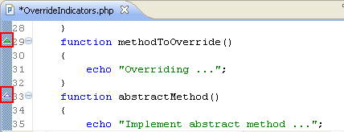
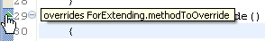

# Override Indicators

<!--context:override_indicators-->

‘Override Indicators’ are markers that display special decoration icons to indicate methods that override or implement other methods from a super-type's class/interface.

The override indicators will be displayed as triangles in the marker bar (the vertical ruler to the left of the editor) next to the method's definition.

Green triangles indicate an overridden method, while a white triangle indicates an implemented method.

Hovering over a triangle displays a tool-tip that reveals the overridden or implemented method's super-type. Clicking the triangle will open the type in an editor.

<!--note-start-->

#### Note:

Markers will not be displayed if the methods do not comply with the overriding rules.

These are as follows:

 * You cannot override a non-static method with a static method.
 * The overriding method must not be more restrictive than the overridden method
 * ‘private’ methods are not inherited and cannot be overridden.
 
<!--note-end-->

##### Override Indicators Preferences

The display preferences for the override indicators can be configured from the [Annotations preferences page](PLUGINS_ROOT/org.eclipse.platform.doc.user/reference/ref-22.htm) (**Window | Preferences | General | Editors | Text Editors | Annotations**).

Select the Override Indicators (org.eclipse.php.ui.overrideIndicator) option to configure the Override Indicators for PHP.

<!--links-start-->

#### Related Links:
 * [Mark Occurrences](048-mark_occurrences.md)
 * [Type Hierarchy](096-show_type_hierarchy.md)

<!--links-end-->
