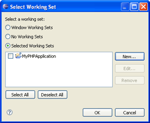

# PHP Working Sets

<!--context:php_working_sets-->

PHP Working Sets are groups of PHP resources which allow you to view or apply actions to a group of pre-defined elements. Workings Sets group elements under one title so that they can be easily selected when viewing resources or carrying out actions. Elements included in a PHP Working Set can include any PHP project, folder or file.

#### Example for using Working Sets:

Selecting the 'Select Working Set' option in the Project Explorer view's context menu allows you to choose specific Working Sets (i.e. group(s) of projects/files) to be displayed in the view.

Projects/files not in the selected Working Set will not be displayed in the view.

If you have not created PHP Working Sets, see [Creating PHP Working Sets](../024-tasks/104-creating_php_working_sets.md) for more information.

<!--links-start-->

#### Related Links:

 * [Creating PHP Working Sets](../024-tasks/104-creating_php_working_sets.md)
 * [Project Explorer View](../032-reference/008-php_perspectives_and_views/008-php_perspective_views/008-php_explorer_view.md)
 * [Window Menu](../032-reference/016-menus/080-window.md)
 * [Search Menu](../032-reference/016-menus/048-search.md)
 * [Searching for PHP Elements](../024-tasks/064-searching_for_php_elements.md)
 * [Project Menu](../032-reference/016-menus/056-project.md)

<!--links-end-->
