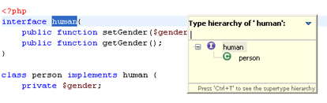
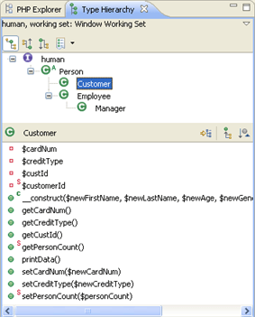

# Type Hierarchy

<!--context:show_type_hierarchy-->

The Type Hierarchy views display the hierarchy for a given type (a class name, interface name or class methods, constants and fields.). This allows you to view an element's supertypes (types higher in the hierarchy) or subtypes (lower in the hierarchy) within a tree structure, providing you with an overview of your element's structure.

A type hierarchy can be displayed in two ways:

1\. **Quick Type Hierarchy view -** Displays a simple hierarchy view within the editor.

2\. **Type Hierarchy view -** A standalone view.
    * The Type Hierarchy Tree - Displays the type's supertypes and/or subtypes.
    * Member list pane - Displays the type's members.

See [Type Hierarchy View](../032-reference/008-php_perspectives_and_views/008-php_perspective_views/024-type_hierarchy_view.md) for more information.

<!--links-start-->

#### Related Links:

 * [Viewing Type Hierarchies](../024-tasks/096-viewing_type_hierarchies.md)
 * [Opening Types/Methods](../024-tasks/080-opening_types_methods.md)
 * [PHP Functions View](../032-reference/008-php_perspectives_and_views/024-php_additional_views/008-php_functions_view.md)

<!--links-end-->
