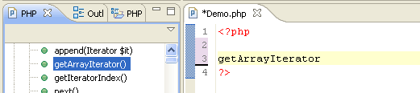
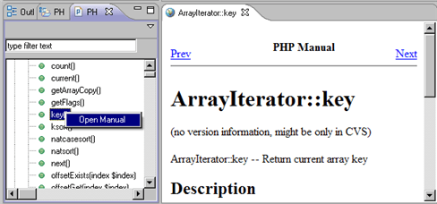

# PHP Manual Integration

<!--context:php_manual_integration-->

PDT can integrate with PHP Manual sites in order to get the most up-to-date PHP information.

The PHP Functions view lists all PHP functions contained within the PHP manuals, and can be used in order to easily add these functions into your scripts. To add a function to your code, simply place the cursor in the required position in the Editor and double-click the required element from the list.

You can open a PHP manual site with an explanation about most of the functions on the list by right-clicking a function in PHP Functions view and selecting **Open Manual**.

A new browser window will open with an explanation of the function from the PHP Manual site.

<!--note-start-->

#### Note:

Some functions will not have a description assigned to them in the PHP Manual site. In this case, a browser will open with a 'Cannot find server' error message.

<!--note-end-->

PHP Manual sites can be added and edited from the [PHP Manual Preferences](../032-reference/032-preferences/072-php_manual.md) page.

In addition, The PHP Functions view can be used in order to easily add functions into your scripts. To add a function to your code, simply place the cursor in the required position in the Editor and double-click the required element from the list.

To open a PHP Manual, right-click in the Editor and click **Open PHP Manual** -or- press **Shift + F2**.

<!--links-start-->

#### Related Links:

 * [PHP Manual Preferences](../032-reference/032-preferences/072-php_manual.md)

<!--links-end-->
