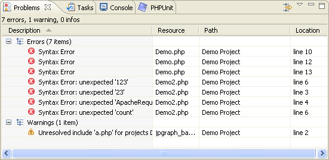

# Real Time Error Detection

<!--context:real_time_error_detection-->

PDT automatically highlights errors and problems in your PHP script.

Errors and warnings will be displayed in the Problems view, accessed from  <a href="javascript:executeCommand('org.eclipse.ui.views.showView(\'org.eclipse.ui.views.showView.viewId=org.eclipse.ui.views.ProblemView\')')">Window | Show View | Other | General | Problems</a>.

In addition, error icons  and warning icons  will be displayed in the vertical marker bar to the left of the editor window, as well as next to the relevant project in Project Explorer view (these will be indicated in the PHP project/file icons - e.g. ).

All warnings, errors and problems in open projects will be logged in the Problems view, which displays the following information:

 * Description - A detailed description of the error.
 * Resource - The name of the resource containing the problem.
 * Path - The name of the Project containing the resource.
 * Location - The line number(s) of the error within the file.
 * Type - The Type of error occurring.

The Problems view groups problems according to Errors, Warnings or Info.

Double-clicking on an error in the Problems view will take you to the relevant location in the Editor.

If the Problems view is not displayed, go to **Window | Show View | Problems**.

<!--links-start-->

#### Related Links:

 * [Concepts](000-index.md)

<!--links-end-->
