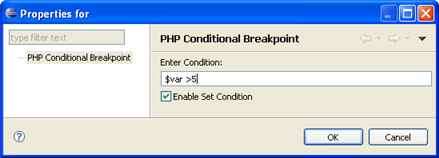

# Breakpoints

<!--context:breakpoints-->

Breakpoints allow you to set places in the code at which the debugging process will pause. Setting a breakpoint in your script will cause the debugger to stop at the specified line, allowing you to inspect it.

Breakpoints are represented by a blue ball in the vertical ruler to the left of the editor.

During the debugging process, breakpoints can be monitored in the [Breakpoints View](../032-reference/008-php_perspectives_and_views/016-php_debug_perspective/024-breakpoints_view.md).

### Conditional Breakpoints

Conditions can be added to breakpoints so that the debugger will only stop at them under certain conditions. These can be any valid boolean expressions.

Conditions can be added to breakpoints through the PHP Conditional Breakpoints Properties dialog. Conditional Breakpoints are represented by a blue ball with a question mark.

#### Example:

If a breakpoint has a condition of "$var > 5", the debugging process will stop at the breakpoint only if the value of $var is greater than 5.

<!--links-start-->

#### Related Links:

 * [Setting Breakpoints](../024-tasks/152-debugging/008-setting_breakpoints.md)
 * [Breakpoints View](../032-reference/008-php_perspectives_and_views/016-php_debug_perspective/024-breakpoints_view.md)
 * [Debugging](128-debugging_concept.md)

<!--links-end-->
