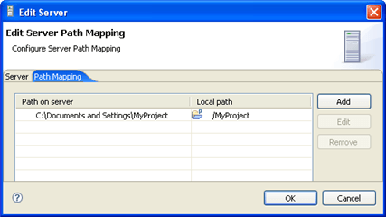
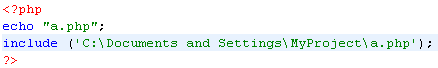
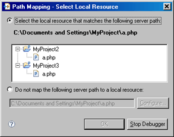

# Path Mapping

<!--context:path_mapping-->

PDT enables you to map server paths to local paths while Debugging on a server.

<!--note-start-->

#### Note:

Path Mapping is only activated during PHP Web Page Debugging.

<!--note-end-->

#### Example:

The server path 'C:\Documents and Settings\MyProject' has been mapped to '/MyProject' on the Workspace:

During PHP Web Page Debugging , a file is called from location 'C:\Documents and Settings\MyProject\a.php':

The file that will open in the editor during Debugging will be the a.php file located in the 'MyProject' project, situated on the Workspace. The file content will still be taken from the server copy.

<!--note-start-->

#### Note:

Server Path Maps can be viewed and defined in the Path Mapping tab of the [PHP Servers Preferences page.](../032-reference/032-preferences/080-php_servers.md)Defining Path Maps

<!--note-end-->

Path Maps can be defined in three ways:

 1. Manually, through the [PHP Servers Preferences page](../032-reference/032-preferences/080-php_servers.md). See '[Adding a Server Location Path Map](../024-tasks/184-adding_a_server_path_map.md)' for more information.
 2. Automatically whenever a file is debugged - A Path Map is automatically set between the path to the debug target's parent project (the parent project of the file from which the debugging process has been launched - e.g. C:\Workspace\MyProject) and the debug target's project in the Workspace (e.g. MyProject).
 3. Through the Path Mapping dialog. This is launched during debugging whenever a file defined with an absolute path (See '[Include Paths](144-include_paths.md)' for more on absolute file locations) is called and found .  In this scenario, a Path Mapping dialog will appear with a list of 'similar files' to the one being called.  'Similar' files are files with the same name as the called file that are situated in the following locations:
    * Files in the project from which the file was called.
    * Files in projects that are in the Include Paths of the project from which the file was called.
    * Files that are open in a PDT editor.

<!--note-start-->

#### Note:

If the debug/profile session was triggered from the Zend Debugger Toolbar, all files in the Workspace with the same name will be listed.

<!--note-end-->

<!--note-start-->

#### Note:

The dialog will not appear if a Path Mapping to the called location has already been defined.

<!--note-end-->

Selecting a file from the list results in a Path Map being created between the called remote file's parent folder and the parent folder of the 'similar' file selected from the list. This means that every time a file is called from the same parent folder, will be searched for in the selected Workspace/local folder and opened during Debugging/Profiling .

If none of the options in the Matching items list represent your desired file location, you may select the 'Do not map the following server path to a local resource: ' option. This means that, during the debugging/profiling process, whenever this path is called, no files will open in the editor.  You can click Configure to modify the path to include any parent or child directories.

<!--links-start-->

#### Related Links:

 * [Include Paths](../024-tasks/168-adding_elements_to_a_project_s_include_path.md)
 * [Adding a Server Location Path Map](../024-tasks/184-adding_a_server_path_map.md)
 * [PHP Servers Preferences](../032-reference/032-preferences/080-php_servers.md)
 * [Using the Debugger](../024-tasks/152-debugging/000-index.md)
 
<!--links-end-->
