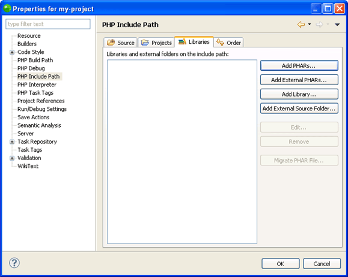

# Phar Integration

<!--context:phar_integration-->

Phar Integration will enable you to integrate with phar archives. Phar is an archive system that enables you to group numerous files into a single file for easy distribution and installation. A phar archive provides a way to distribute a complete PHP application in a single file and run it from that file without needing to even use a disk. Using a Phar archive library is identical to using any other PHP library.

Phar Integration  contains the following features:

 * Export to phar.
 * Import to phar.
 * Add phar to your project.

Please [click here](http://nl.php.net/manual/en/book.phar.php) for more information on Phar (external link).

Phar integration settings are defined per project and are part of the project library settings.

