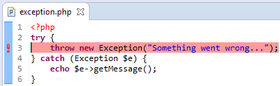

# Exception Breakpoints

<!--context:exception_breakpoints-->

**NOTE:** Exception breakpoints are supported by **XDebug** only. 

Exception breakpoints allow you to choose and set exception type or error condition on which the debugging process will break. Setting an exception breakpoint will cause the debugger to stop whenever related exception or error is raised, allowing you to inspect it.

Exception breakpoints are represented by a colored exclamation mark annotation in the vertical ruler to the left of the editor.

During the debugging process, breakpoints can be monitored in the [Breakpoints View](../032-reference/008-php_perspectives_and_views/016-php_debug_perspective/024-breakpoints_view.md).

<!--links-start-->

#### Related Links:

 * [Setting Exception Breakpoints](../024-tasks/152-debugging/048-setting_exception_breakpoints.md)
 * [Breakpoints View](../032-reference/008-php_perspectives_and_views/016-php_debug_perspective/024-breakpoints_view.md)
 * [Debugging](128-debugging_concept.md)

<!--links-end-->
