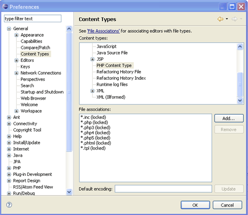

# Opening an External File

<!--context:opening_an_external_file_in_neon-->

These procedures describe how to open external files in PDT .

External files can be opened in PDT in  two ways:

 * Dragging-and dropping the file into PDT .
 * Using the Open function in PDT .

Once external files have been opened in PDT , you can perform operations such as running or debugging on them.

<!--ref-start-->

To open a file by dragging-and-dropping:

 1. Find your file in your external file system.
 2. Have both PDT and your file system explorer open and visible on your desktop.
 3. Drag and drop the file into the editor space in PDT .

The file will be displayed in an editor and will be available for PDT debugging operations .

<!--ref-end-->

<!--ref-start-->

To open a file by double-clicking:

 1. If the file type you are trying to open was associated with PDT during installation, simply double-clicking it in your external file system will cause it to be opened in PDT .
 2. If the file type was not associated with PDT you can:
    * Right-click the file and select**Open With | Choose Program | PDT**.
    * -Or- Add the file type to the list of file types which will automatically be opened in PDT by doing the following:
 2. From PDT 's Menu Bar, go to **Window | Preferences | General | Content Types**.  The Content Types dialog will be displayed.
 3. Select **Text | PHP Content Type** from the list.  A list of file types associated with PDT will be displayed.   
 4. Click **Add**to add your file's type to the list,
 5. Enter the file type (e.g. .php) and click **OK**.
 6. The file type will be added to the list.
 7. Open your Windows Explorer.
 8. Go to **Tools | Folder Options | File Types**.
 9. From the File Types list, select PHP File.
 10. In the Opens with category click Change, browse to your PDT .exe location and click **OK**.
 11. Click **Apply**.

You can now double-click the file on your external file system to open it in PDT .

The file will be displayed in an editor.

<!--ref-end-->

<!--ref-start-->

To open a file using PDT 's file open function:

 1. In PDT , go to **File | Open File**.
 2. Browse for your file in your file system.
 3. Select the required file and click **Open**.
 
The file will be displayed in an editor.

<!--ref-end-->

<!--links-start-->

#### Related Links:

 * [Easy File Creation](000-index.md)
 * [Creating a PHP File Within a Project](008-creating_a_php_file_within_a_project.md)

<!--links-end-->
