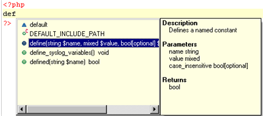

# Using Content Assist

<!--context:using_code_assist-->

This procedure describes how to use Content Assist in order to quickly and easily insert code elements into your script:

<!--ref-start-->

To use Content Assist:

 1. Enter the first few characters of the required code element into the editor.  The Content Assist window should be automatically displayed.
 2. If the Content Assist window does not pop up automatically, press **Ctrl+Space**. 
 3. Use the arrow keys to scroll through the code completion options. The window on the right will display descriptions and hints for using the selected code element.
 4. Select the required option by double-clicking it or selecting it and pressing **Enter**.

The selected code will be inserted into your script.

<!--ref-end-->

To enable the Content Assist window to open automatically, go to the [Content Assist Preferences page](../032-reference/032-preferences/040-editor/008-code_assist.md), accessed from **Window | Preferences | PHP | Editor | Content Assist** and mark the "Enable auto-activation'' checkbox. This is marked by default.

<!--links-start-->

####Related Links:

 * [Content Assist](../016-concepts/016-code_assist_concept.md)
 * [Working with Content Assist](../008-getting_started/016-basic_tutorial/016-working_with_code_assist.md)
 * [Content Assist Preferences](../032-reference/032-preferences/040-editor/008-code_assist.md)
 * [Hover Support](../016-concepts/072-hover_support.md)
 * [Commenting PHP DocBlocks](128-commenting_php_docblocks.md) 
 * [Using Templates](032-using_templates.md)

<!--links-end-->
