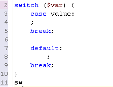

# Using Templates

<!--context:using_templates-->

Templates are shortcuts used to insert a pre-defined framework of code into your scripts. The purpose is to save time and reduce the potential for errors in standard, repetitive code units. Once a template is inserted, you can complete the code quickly using manual and automated code entry methods.

Requirements:

A template must be defined in the Templates list in the [Template Preferences page](../032-reference/032-preferences/040-editor/064-templates.md), accessed from **Windows | Preferences | Templates**, before it can be used. To learn how to create a new template from the Templates Preferences page, see [Adding a New Template.](../032-reference/032-preferences/040-editor/064-templates.md#Adding_new_templates)Templates are context sensitive and can be used in HTML, PHP, PHPDOC, JavaScript or CSS. The context of the current code being entered defines which templates are available. For example, PHP templates are not available if your current code is Java.

### Inserting a Template into Code

This procedure describes how to insert a template into your script.

<!--ref-start-->

To insert a template:

 1. Place your cursor at the desired insertion point.
 2. Enter a character string (e.g. "Sw").
 3. Click **Ctrl+Space**.   The [Content Assist](../008-getting_started/016-basic_tutorial/016-working_with_code_assist.md) box will appear, listing all available templates and completion options that begin with that combination of keys.  Templates are marked in the content assist list with a blue square. 
 4. Double-click the required template from the list.  The template will be entered into your code.

<!--ref-end-->

#### Example:

Entering "sw" and selecting the  "switch statement" template from the list will give you the following code:

<!--note-start-->

#### Note:

Templates can be created, imported and exported through the [Template Preferences page](../032-reference/032-preferences/040-editor/064-templates.md), accessed from **Window | Preferences | PHP | Templates**.

<!--note-end-->

<!--links-start-->

#### Related Links:

 * [Templates Preferences](../032-reference/032-preferences/040-editor/064-templates.md)
 * [Using Content Assist](024-using_code_assist.md)

<!--links-end-->
