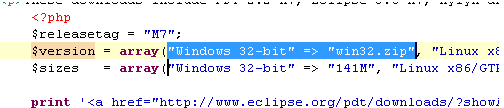

# Drag and Drop

<!--context:drag_and_drop-->

The Drag and Drop functionality allows you to click on a selected chunk of code and drop it anywhere in the editor. This not only helps you work more efficiently, but also helps minimize the errors that are created when editing or cutting/pasting your code.

Drag and Drop is available in PHP and JavaScript editors.

<!--ref-start-->

To Drag and Drop a chunk of code in an editor:

 1. Highlight the chunk of code you want to move with your cursor.
 2. Click and hold down your mouse within the highlighted code to grab it, and drag the chunk to the selected line in the editor.
 3. Release the mouse to place the chunk of code in its new location.  

For more information on editors see the [Editors](PLUGINS_ROOT/org.eclipse.platform.doc.user/concepts/concepts-6.htm) topic in the Workbench User Guide.

<!--ref-end-->

<!--links-start-->

#### Related Links:

 * [Editor Preferences](../032-reference/032-preferences/040-editor/000-index.md)

<!--links-end-->
