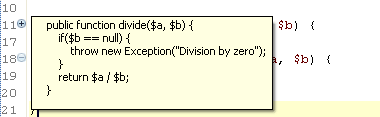

# Using Code Folding

<!--context:using_code_folding-->

Code Folding collapses or "folds" the display of a block of code.

To enable code folding, go to the [Folding Preferences](../032-reference/032-preferences/040-editor/016-folding.md) page, accessible from **Window | Preferences | PHP | Editor | Using Code Folding**.

If Code Folding is enabled, minus signs will appear in the Annotation Bar next to code blocks which can be folded. In addition, certain elements will be folded by default according to the Folding Preferences settings.

<!--ref-start-->

To fold a block of code:

 1. Stand within a class, function or PHPDocBlock.
 2. Click the **minus sign** on the marker bar to the left of the editor.

The first line of code will remain visible but the other lines will not be displayed. A fold indicator will appear at the end of the line when the code is folded to indicate that there is hidden code.

To temporarily view folded code, hover over the **plus sign** that denotes a folded block. The folded code will be displayed in a floating block.

<!--ref-end-->

<!--ref-start-->

To unfold a block of code:

 1. Click the **plus sign**.
 2. The folded code will become visible again and the fold indicator will disappear.

To view the scope of a fold:

 1. Hover over the **minus sign**.
 2. A vertical line will be displayed from the first to the last line of the fold, indicating its range.

<!--ref-end-->

<table>
<tr><td></td>

<td></td></tr>

<tr><td>An unfolded function</td>

<td>A folded function</td></tr>

</table>

<!--ref-start-->

To fold/unfold nested functions:

 1. Click on one of the **minus signs** of a nested function. All levels below this level will be folded into it. You can continue to fold until all levels have been folded into the topmost level.
 2. To unfold nested functions, click on the **plus sign**. The folded code will open in the same order that it was folded.  

<!--ref-end-->

<!--note-start-->

#### Note:

Line numbers are folded together with the code. Folding and unfolding does not change line numbers, it can only hide/display them.

<!--note-end-->

<!--note-start-->

#### Note:

If the folded code contains an error, the displayed window will be syntax highlighted on both the left and right Annotation bars.

<!--note-end-->

<!--links-start-->

#### Related Links:

 * [Code Folding](../016-concepts/056-code_folding.md)
 * [Code Folding Preferences](../032-reference/032-preferences/040-editor/016-folding.md)

<!--links-end-->
