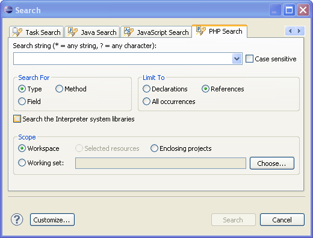
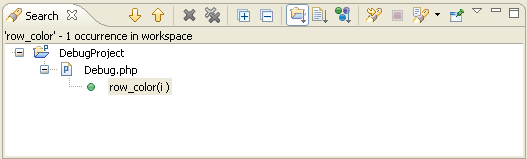

# Searching for PHP Elements

<!--context:searching_for_php_elements-->

Searching for PHP elements is a functionality that allows you to search for PHP elements with your defined specifications. PHP elements are classes, functions, constants, types, methods and references/declarations that are used in your code. Use this option if you want to locate one of these elements in your workspace, project or in a single file.

<!--note-start-->

#### Note:

For information about the "Search" tab in the "Search" dialog, read below. To learn more about the additional tabs in the "Search" dialog see [File Search](PLUGINS_ROOT/org.eclipse.platform.doc.user/reference/ref-45.htm) in the [Workbench User Guide](../../nav/10). If you are using the Remote Search option, be aware that it does not search all of the resources of the remote server.

<!--note-end-->

This procedure describes how to search for PHP elements (classes, functions and constants) within your files and projects.

<!--ref-start-->

To search for a PHP element:

 1. From the Menu Bar go to **Search | Search**-or- press **Ctrl+H**.  The "PHP Search" dialog will open.  
 2. Enter a search string. You have the option of using [Wildcards](PLUGINS_ROOT/org.eclipse.platform.doc.user/reference/ref-45.htm).

You can make your search case sensitive by selecting the "Case sensitive" box.

 1. Select whether to search for a:
    * **Type** - A class (This option will search for both methods and fields.)
    * **Method** - A function
    * **Field** - A constant
 2. Select whether to limit your search to:
    * **Declarations**- The location where the type, method, or field are defined.
    * **References** - Anywhere the type, method, or field are referred to.
    * **All occurrences**- Anywhere the type, method, or field are referred to or declared.
 3. To extend your search to include interpreter system libraries, select the "Search the Interpreter system libraries" box. This allows PDT to search in the libraries of the PHP version you have selected in the [PHP Interpreter Preferences](../032-reference/032-preferences/064-php_interpreter.md).
 4. Select whether to search in your:
    * **Workspace** - The entire workspace.
    * **Selected resources**- Select these in Project Explorer view before opening the "Search" dialog. All sub-files and sub-folders within the selected resource will be included in the search.
    * **Enclosing projects**- The projects which the selected resources are in.
    * **Working Set**- Click **Choose...**to select the required Working Set.
 5. Click **Search**

The Search view will open displaying the results of the search.

To go to an element, double-click the required option from the search view.

<!--ref-end-->

<!--note-start-->

#### Note:

By default, the File Search, Remote Search, Task Search, Java Search and JavaScript Search dialogs will be tabbed with the PHP Search dialog. To make these unavailable, click **Customize...**within the PHP Search dialog and unmark required options.

<!--note-end-->

## Hotkeys

**The following hotkeys are available**:

<table>
<tr><th>Action</th>
<th>Shortcut</th></tr>

<tr><td>Esc / Alt+F4</td>
<td>Closes the Search dialog.</td></tr>

<tr><td>Alt + A</td>
<td>Brings the cursor to the "Search string" field.</td></tr>

<tr><td>Alt + I</td>
<td>Checks/unchecks the "Case Sensitive" checkbox.</td></tr>

<tr><td>Alt + T</td>
<td>Checks "Type" in the "Search For" box.</td></tr>

<tr><td>Alt +M</td>
<td>Checks "Method" in the "Search For" box.</td></tr>

<tr><td>Alt +F</td>
<td>Checks "Field" in the "Search For" field.</td></tr>

<tr><td>Alt +L</td>
<td>Checks "Declarations" in the "Limit To" field.</td></tr>

<tr><td>Alt +R</td>
<td>Checks "References" in the "Limit To" field.</td></tr>

<tr><td>Alt +O</td>
<td>Checks "All occurrences" in the "Limit To" field.</td></tr>

<tr><td>Alt +Y</td>
<td>Checks/unchecks the "Search the Interpreter system libraries"field.</td></tr>

<tr><td>Alt + W</td>
<td>Selects "Workspace" in the "Scope" field.</td></tr>

<tr><td>Alt + D</td>
<td>Selects "Selected resources" in the "Scope" field.</td></tr>

<tr><td>Alt + J</td>
<td>Selects "Enclosing projects" in the "Scope" field.</td></tr>

<tr><td>Alt + K</td>
<td>Selects "Working set" in the "Scope" field.</td></tr>

<tr><td>Alt + H</td>
<td>Opens the "Select Working Sets" dialog.</td></tr>

<tr><td>Alt + S</td>
<td>Performs the search and shows the results in the Search view.</td></tr>

<tr><td>Alt +Z</td>
<td>Opens the "Search Page Selection" dialog and allows you to customize the search page.</td></tr>
</table>

<!--links-start-->

#### Related Links:

 * [Search Menu](../032-reference/016-menus/048-search.md)

<!--links-end-->
