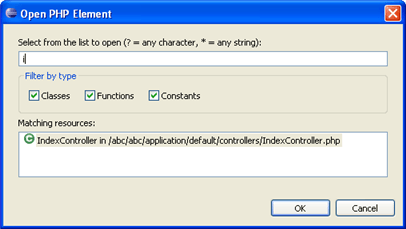

# Opening PHP Elements

<!--context:opening_php_elements-->

This procedure describes how to use the Open PHP Element function to navigate to a PHP element (Class, Function or Constant) in an open project.

<!--ref-start-->

To open a PHP Element:

 1. From the Menu Bar, go to **Navigate | Open PHP Element** -or- click the Open PHP Element icon on the Toolbar .  The "Open PHP Element" dialog will open.
 2. Enter the first few characters of the element which you want to open.  Resources that begin with those letters will appear in the 'Matching Resources' pane, listed alphabetically.  
 3. You can filter by element type (class, function or constant) by marking/unmarking the relevant checkboxes.
 4. Select the required element and click **OK**.

The file containing the element declaration will open in the editor, with the element highlighted.

<!--ref-end-->

<!--links-start-->

#### Related Links:

 * [Navigate Menu](../032-reference/016-menus/040-navigate.md)
 * [Hover Support](../016-concepts/072-hover_support.md)
 * [Using Smart Goto Source](088-using_smart_goto_source.md)

<!--links-end-->
