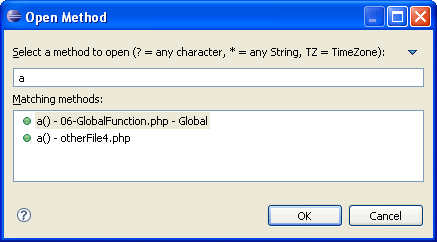

# Opening Types/Methods

<!--context:opening_types_methods-->

You can open any method or type in your workspace using the "Open Type" wizard or the "Open Method" wizard.

<!--ref-start-->

To open a Type or Method:

 1. From the Menu Bar, go to **Navigate | Open Type or Open Method**  -Or- press **Ctrl+Shift+T**(for a type) or **Ctrl+Shift+M**(for a method).  The "Open Type/Method" dialog will appear. If a type/method was previously selected in the editor or outline views, it will be displayed. 
 3. Begin typing the string of the required type/method to filter the results.  You may use wild cards or CamelCase notation (e.g. DTB for DateTextBox).
 4. Select the required type/method from the list and click **OK**.  You may restrict the results displayed in the Open Type list to a particular [Working Set](../016-concepts/088-php_working_sets.md) through the wizard's menu (accessed by clicking the arrow in the top-right corner).

An editor will open on the selected type/method.

<!--ref-end-->

<!--note-start-->

#### Note:

The "Open Type" dialog maintains a history of recently opened types. These are shown when the dialog is opened and stay above a separator line when you start to type a filter expression.

<!--note-end-->

<!--links-start-->

#### Related Links:

 * [Type Hierarchy](../016-concepts/096-show_type_hierarchy.md)
 * [Searching for PHP Elements](064-searching_for_php_elements.md)

<!--links-end-->
