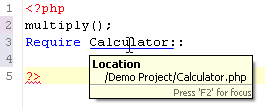

# Using Smart Goto Source

<!--context:using_smart_goto_source-->

This procedure describes how to use the Smart Goto Source function in order to easily navigate to an element's declaration.

<!--ref-start-->

To use the Smart Goto Source function:

 1. Hover over the element whose source declaration you want to navigate to.  A tooltip will be displayed showing the element's original location. 
 2. Hold down the **Ctrl**key and move the cursor until the element is underlined.
 3. Click the element.

You will be automatically taken to the element's source code. If the declaration is in a different file, this file will be opened.

<!--ref-end-->

<!--links-start-->

#### Related Links:

 * [Hover Support](../016-concepts/072-hover_support.md)
 * [Hover Preferences](../032-reference/032-preferences/040-editor/024-hovers.md)

<!--links-end-->
