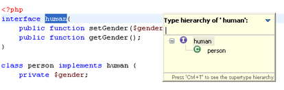
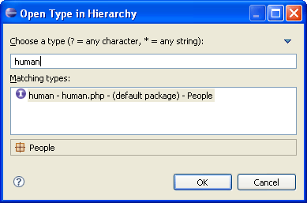
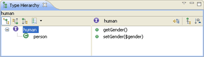

# Viewing Type Hierarchies

<!--context:viewing_type_hierarchies-->

[Type hierarchies](../016-concepts/096-show_type_hierarchy.md) can be viewed in either a Quick Type Hierarchy view or in the Type Hierarchy view.

## Viewing Types in the Quick Type Hierarchy View

<!--ref-start-->

To view a type in a Quick Type Hierarchy view:

 1. Select the type name in the PHP editor, or Project Explorer or outline views.
 2. Press **Ctrl+T**.  -Or- from the Menu Bar go to **Navigate | Quick Type Hierarchy**.
The Quick Type Hierarchy view will be displayed in the editor with the selected type.
 

<!--ref-end-->

<!--note-start-->

#### Note:

Pressing **Ctrl+T**while the quick type hierarchy view is shown will toggle between supertype hierarchy and subtype hierarchy.

<!--note-end-->

## ViewingTypes in the Type Hierarchy View

Types can be viewed in the Type Hierarchy view by searching for them using the "Open Type in Hierarchy" dialog or by directly selecting the element in the editor or Project Explorer.

<!--ref-start-->

To view a type in the Type Hierarchy view:

Through the "Open Type in Hierarchy" wizard:

 1. Press **Ctrl+Shift+H**-or- from the Menu Bar go to **Navigate | Open Type in Hierarchy**.  The "Open Type in Hierarchy" dialog is displayed.  
 2. If a type was previously selected in the editor or outline views, it will be entered in the type field.  If a type was not selected, begin typing the string of the required type/method to filter the results.  You may use wild cards or CamelCase notation (e.g. DTB for DateTextBox).
 3. Select the required type and click **OK**.

Directly from the editor or Project Explorer:

 1. Select a type in the editor or Project Explorer.
 2. Press **F4**.

<!--note-start-->

#### Note:

The action will not be activated if the selection is not a resolvable element (i.e. if the selection is not a class name, interface name or class method, constant or field).
The type will be displayed in the Type Hierarchy view.

<!--note-end-->

<!--ref-end-->

<!--links-start-->

#### Related Links:

 * [Type Hierarchy](../016-concepts/096-show_type_hierarchy.md)
 * [Opening Types/Methods](080-opening_types_methods.md)
 * [PHP Functions View](../032-reference/008-php_perspectives_and_views/024-php_additional_views/008-php_functions_view.md)

<!--links-end-->
