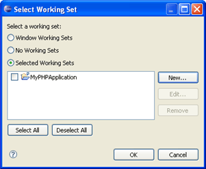

# Creating PHP Working Sets

<!--context:creating_php_working_sets-->

[PHP Working Sets](../016-concepts/088-php_working_sets.md) can be created from a variety of locations where working sets can be selected.

This procedure describes how to create PHP Working Sets from the context menu in Project Explorer.

<!--ref-start-->

To create a PHP Working Set:

 1. In the Project Explorer view click the View Menu arrow.  The Project Explorer menu options will open. Select 'Select Working Set...'.  The "Select Working Set" dialog will open.  
 2. Click**New**.  The "New Working Set" dialog will open.
 3. Select PHP and click **Next**.  The "New PHP Working Set" dialog will appear.
 4. Enter a name for the Working Set.
 5. Mark the checkbox next to the projects/files/folders to be included in the Working Set.
 6. Click **Finish**.

Your new PHP Working Set will be added to the "Select Working Set" dialog and will be available for selection for Working Sets actions.

<!--ref-end-->

<!--links-start-->

#### Related Links:

 * [PHP Working Sets](../016-concepts/088-php_working_sets.md)
 * [Project Explorer View](../032-reference/008-php_perspectives_and_views/008-php_perspective_views/008-php_explorer_view.md)
 * [Window Menu](../032-reference/016-menus/080-window.md)
 * [Search Menu](../032-reference/016-menus/048-search.md)
 * [Searching for PHP Elements](064-searching_for_php_elements.md)
 * [Project Menu](../032-reference/016-menus/056-project.md)

<!--links-end-->
