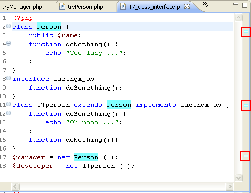

# Using Mark Occurrences

<!--context:using_mark_occurrences-->

The Mark Occurrences feature allows you to see where a variable, method or type is referenced within the active PHP file.

<!--ref-start-->

To use Mark Occurrences:

 1. Enable the Mark Occurrences feature by clicking the Mark Occurrences icon on the toolbar  -or- pressing **Alt+Shift+O**.  When the Mark Occurrences feature is enabled, the icon will be highlighted.
 2. Place your cursor on the required element in your file.  

All instances where the element is referenced within the file will be highlighted and annotations will be displayed in the annotation bar.

<!--ref-end-->

<!--note-start-->

#### Note:

See [Mark Occurrences Preferences](../032-reference/032-preferences/040-editor/032-mark_occurences.md) for information on configuring your Mark Occurrences settings.

<!--note-end-->

<!--links-start-->

#### Related Links:

 * [Mark Occurrences](../016-concepts/048-mark_occurrences.md)
 * [Mark Occurrences Preferences](../032-reference/032-preferences/040-editor/032-mark_occurences.md)

<!--links-end-->
