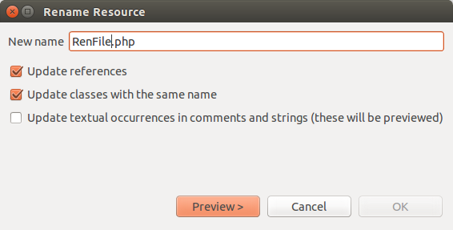
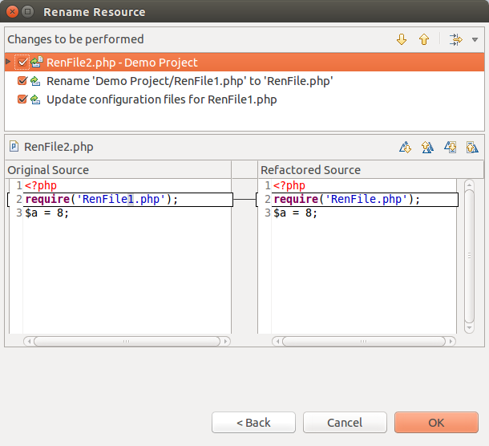

# Renaming Files

<!--context:renaming_files-->

This procedure describes how to rename files and update all instances where that file is referenced within the project.

<!--note-start-->

#### Note:

Ensure that you save any changes to the file before applying the refactoring feature.

<!--note-end-->

<!--ref-start-->

To rename a file using the Refactoring feature:

1. In Project Explorer view, right-click the file which you would like to rename and select **Refactor | Rename** -or- select it and go to **Refactor | Rename** from the Menu Bar.  
   A Rename File dialog will appear.
   
2. Enter the file's new name.
3. Check the "Update references" box and click **Preview**.  
   A preview window will open with a change tree showing all the changes which will be made to reflect the rename of the file, sorted according to the files in which the changes will be made.
     
   Note that, if the file has been referenced (required, included etc.) in other files, the name of the file will also be updated in those instances.
4. You can scroll through the different changes using the Select Next / Previous Change scrolling arrows .
5. If you are satisfied with the changes, press **OK**.

The file will be renamed and all instances where that file is referenced will be updated to reflect the change.

<!--ref-end-->

<!--links-start-->

#### Related Links:

 * [Refactoring](../../016-concepts/076-refactoring.md)
 * [Using Refactoring](000-index.md)

<!--links-end-->