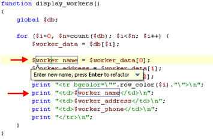
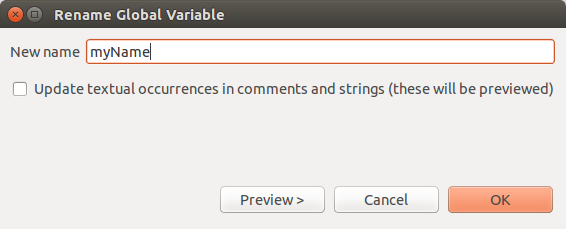
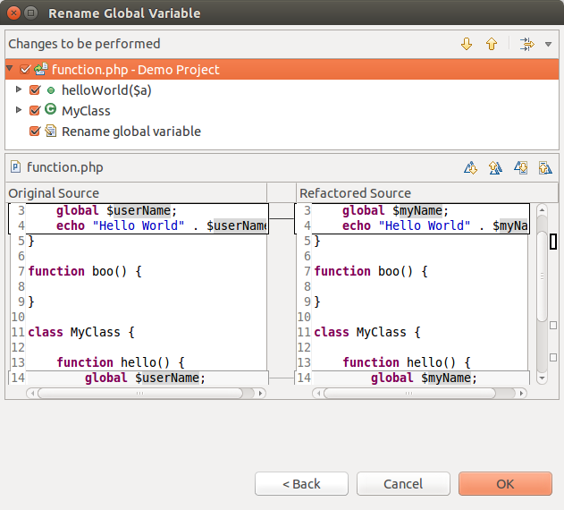
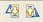

# Renaming Elements

<!--context:renaming_elements-->

This procedure describes how to rename a PHP element and ensure that all references to that element are updated.  
All PHP elements can be renamed and refactored from Project Explorer view. The following is a list of applicable PHP elements:

* Classes
* Interfaces
* Variables
* Methods
* Functions
* Constants
* Class Members

<!--note-start-->

#### Note:

Ensure that you save any changes to the file before applying the refactoring feature.

<!--note-end-->

Elements can either be renamed [from within the editor](#renaming-elements-within-the-editor) itself if the in-place refactoring feature is activated (will not display a preview of changes) or from the [Rename Element](#renaming-elements-through-the-refactor-dialog) dialog.

## Renaming Elements within the Editor

<!--ref-start-->

To rename an element within the editor:

1. Ensure the 'Rename in editor without dialog' checkbox is marked in the [Code Refactor Preferences](../../032-reference/032-preferences/020-code_refactor.md) page (accessible from **Window | Preferences | PHP | Code Refactor**).
2. In the editor, place your cursor on the element to be renamed.
3. From the menu bar select **Refactor | Rename** -or- right-click and select **Refactor | Rename** -or- press **Alt-Shift-R**.  
   All occurrences of the element are put in a frame and the Refactor popup is displayed.
     
4. Type the new element name in the box.  
   All occurrences of the element name are automatically updated.  
   Note: To preview the changes before applying them, click the arrow in the right-hand corner of the Refactor popup and select **Preview**.
5. Click **Enter** to apply the refactoring.  
   A dialog is displayed prompting you to save the file before the refactoring is applied.
6. Mark the 'Always save all modified resources automatically prior to refactoring' checkbox so that the dialog will not be displayed again.
7. Click **OK**.

The element will be renamed and all instances where that element is referenced will be updated to reflect the changes.

<!--ref-end-->

## Renaming Elements through the Refactor Dialog

<!--ref-start-->

To rename an element through the Refactor dialog:

1. Ensure the 'Rename in editor without dialog' checkbox is unmarked in the [Code Refactor Preferences](../../032-reference/032-preferences/020-code_refactor.md) page (accessible from **Window | Preferences | PHP | Code Refactor**).
2. In the editor, place your cursor on the element to be renamed or select it in the Project Explorer.
3. From the menu bar select **Refactor | Rename** -or- right-click and select **Refactor | Rename** -or- press **Alt-Shift-R**.  
   The Rename dialog box will be displayed. The name of the dialog will be dependent on the element type.
     
4. Enter the element's new name. You must enter a valid name for the required element - i.e. one that starts with a letter or underscore, followed by any number of letters, numbers, or underscores.
5. Check the "Update textual occurrences in comments and strings" box if you want the element's name to be updated in all comments and strings where it is referenced.  
   This will force you to preview the changes before applying them.
6. Click **OK** to apply your changes or click **Preview** if you want to see a preview of the changes that this refactoring will create.
7. If you clicked preview a preview window will open with a changes tree showing all the changes which will be made to reflect the rename of the element.  
   The changes will be listed according to the context within which they appear. You can therefore expand the nodes to see all changes within particular files, classes or functions.
8. Use the Next / Previous Change arrows  to scroll through all possible changes.  
   Unmarking the checkboxes next to the changes will cause those changes not to take effect.
     
   Note that if changes will be made in other files which reference the element being refactored, the changes will also be listed here under the file name.
9. The changes to be applied will be displayed in the bottom pane.  
   You can scroll through the different changes using the scrolling arrows:
   \- Next / Previous Difference scrolling arrows  - Scroll through changes to be applied within the element selected in the top pane.
   \- Next / Previous Change scrolling arrows  - Scroll through all changes to be applied. If you unmarked changes in the top pane, these will not be displayed when using these arrows.
10. Once you are satisfied with the changes, click **OK**.

The element will be renamed and all instances where that element is referenced will be updated to reflect the changes.

<!--ref-end-->

<!--links-start-->

#### Related Links:

 * [Refactoring](../../016-concepts/076-refactoring.md)
 * [Using Refactoring](000-index.md)

<!--links-end-->