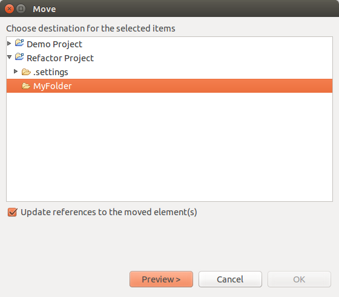
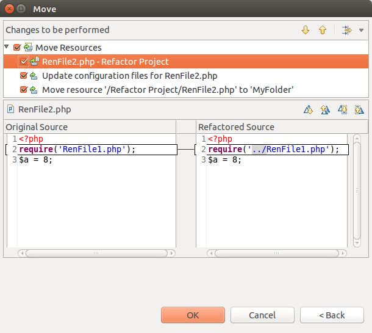

# Moving Files

<!--context:moving_files-->

This procedure describes how to move a file, which will result in the automatic updating of all instances where that file is referenced (required, included etc.) within the project to reflect its change of location.

<!--note-start-->

#### Note:

Ensure that you save any changes to the file before applying the refactoring feature.

<!--note-end-->

<!--ref-start-->

To move a file:

1. In Project Explorer view, right-click the file which you would like to rename and select **Refactor | Move** -or- press **Alt-Shift-V**.  
   A Move File dialog will appear.
   
2. Select the new location of the file.
3. Check the "Update references" box and click **Preview**.  
   A preview window with a changes tree will open showing all the changes which will be made to reflect the move of the file.
   
4. You can scroll through the different changes using the Select Next / Previous Change scrolling arrows .  
   Note that, if the file has been referenced (required, included etc.) in other files, the reference to the location of that file in other files will also have been changed.
5. Unmark the checkbox of changes which you do not want applied.
6. If you are satisfied with the changes, press **OK**.

The file will be moved and the file's new location will be updated in all instances where that file is referenced.

<!--ref-end-->

<!--links-start-->

#### Related Links:

 * [Refactoring](../../016-concepts/076-refactoring.md)
 * [Using Refactoring](000-index.md)

<!--links-end-->