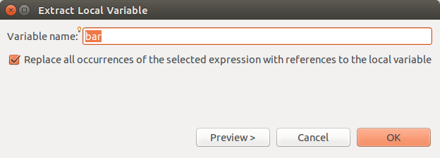
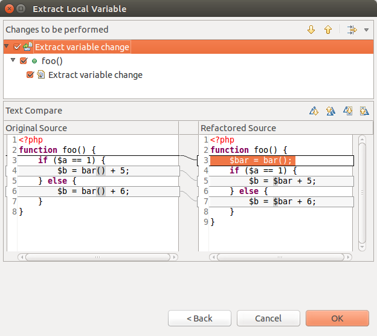

# Extracting Variables

<!--context:extracting_variables-->

The extract variable feature can create a local variable to replace all occurrences of a given expression.

<!--ref-start-->

To create a new variable from an expression:

1. Place your cursor on the expression which you would like to replace with a variable.
2. Right-click and select **Refactor | Extract Variable** -or- press **Alt+Shift+L**.  
   The Extract Local Variable dialog is launched.
   
3. Enter the name of the new variable in the Variable name field.
4. Mark the checkbox so that all occurrences of the selected expression will be replaced by references to the local variable.
5. Click **OK** to apply your changes or click **Preview** if you want to see a preview of the changes that this refactoring will create.
6. If you clicked preview a preview window will open with a changes tree showing all the changes which will be made to reflect the extracting of the variable.
   
7. The changes will be listed according to the context within which they appear. You can expand the nodes to see all changes within particular files, classes or functions.
8. Use the Next / Previous Change arrows  to scroll through all possible changes.  
   Unmarking the checkboxes next to the changes will cause those changes not to take effect.
9. Click **OK** to apply the changes.

The variable will be extracted and the relevant changes made to the code.

<!--ref-end-->

<!--links-start-->

#### Related Links:

 * [Refactoring](../../016-concepts/076-refactoring.md)
 * [Using Refactoring](000-index.md)

<!--links-end-->