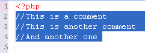

# Adding Comments

<!--context:how_to_comment_and_uncomment_php_code-->

PDT allows you to quickly and easily comment and uncomment code by selecting a line or a block of text and tagging it as a comment.

Comments can be added to single lines of code (**Ctrl + /**) or blocks of code (**Ctrl + Shift + /**).

In addition, special PHPDocBlock comments can also be added. See "[Adding PHP DocBlock Comments](128-commenting_php_docblocks.md)" for more information.

The following procedures describe how to comment and uncomment lines and blocks of code.

<!--ref-start-->

To comment a line:

 1. Place the cursor anywhere on the required line of code.
 2. Press **Ctrl + /**  Two slashes "//" will be added to the front of the line, causing it to be recognized as a comment.  
 
<!--ref-end-->

<!--ref-start-->

To comment more than one line:

 1. Select all the lines that you would like to be commented.
 2. Press **Ctrl + /**  Two slashes "//" will be added to the front of each line, causing them to be recognized as a comment.  

<!--ref-end-->

<!--ref-start-->

To uncomment a line / lines:

 1. Select the required line(s).
 2. Press **Ctrl + /**  The commenting formatting will be removed from the code.

<!--ref-end-->

<!--ref-start-->

To comment  a block:

 1. Select the required block of code.
 2. Press **Ctrl + Shift + /**  The beginning (/*) and ending (*/) characters will be added in the appropriate places in order to mark the selected block as a comment.  

<!--ref-end-->

<!--links-start-->

#### Related Links:

 * [Commenting Code](../016-concepts/064-commenting_code/000-index.md)
 * [phpDoc Comments](../016-concepts/064-commenting_code/008-phpdoc_comments.md)
 * [Commenting PHP DocBlocks](128-commenting_php_docblocks.md)

<!--links-end-->
