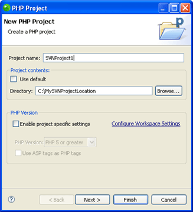

# Accessing an Existing CVS Checkout

<!--context:accessing_an_existing_cvs_checkout-->

This procedure shows you how to access projects in PDT that you have previously checked out from CVS. This means you do not have to check out resources again to a new location in order to have access to PDT 's functionality.

<!--ref-start-->

To access previously checked out projects:

 1. Launch the New PHP Project Wizard by going to **File | New | PHP Project** -or- right-clicking in Project Explorer view and selecting **New | PHP Project**.  The "New PHP Project" wizard will open.
 2. In the Project contents category, unmark the Use default checkbox and browse to the location of your checked out CVS resources. 
   
 3. Click **Finish**.  A new PHP Project will be created with the contents of the project you had checked out.
 4. In Project Explorer View, right-click your project and select **Team | Share Project**.  A "Share Project" dialog will open.
 5. From the repository list, select CVS and click **Next**.
 6. If you have not yet configured a CVS repository, you will need to enter your CVS repository details. See Configuring a CVS Connection for more information.  If you have already configured a CVS connection, mark the 'Use existing repository location' option and select your repository from the list.
 7. Click **Finish**.
 8. Depending on your authentication settings, a dialog might appear asking you to provide authentication information.  Enter your password and click **Next**. (Mark the Save Password checkbox to ensure that this screen does not reappear.)  A "Commit" dialog will open.
 9. Enter a comment if required and click **OK**.

Your project will be uploaded to the CVS repository.

Your project will have a repository icon next to it in Project Explorer view, indicating that it is linked to an CVS repository.  Your can now perform all CVS functions (commit, update etc.) on this project.

<!--ref-end-->
