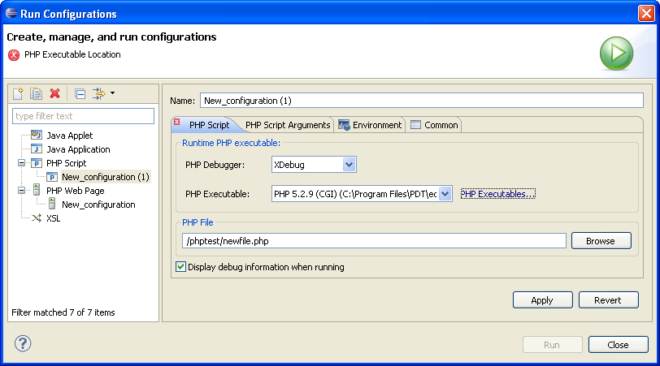

# Running PHP Scripts Remotely

<!--context:running_php_scripts_remotely-->

This procedure describes how to run files in your workspace using your server's debugger. Use this function if you want to test the execution of the file in 'real time' on the production server. This is especially relevant if your server has loaded extensions.

<!--note-start-->

#### Note:

Your server must be running the Xdebug or Zend Debugger in order for remote debugging  capabilities to function.

<!--note-end-->

<!--ref-start-->

To remotely run a PHP Script:

 1. Click the arrow next to the Run button  on the toolbar and select Run Configurations -or- go to **Run | Run Configurations**.  A Run dialog will open.
 2. Double-click the PHP Script option to create a new run configuration.   1. Enter a name for the new configuration.
 3. Select the PHP Web Server option under the Debugger Location category.
 4. Select your server from the list.  If you have not yet configured your server, click the underlined 'PHP Servers' shortcut. The Servers preferences page will open. Configure your server by following the instructions on '[adding a new server](../../032-reference/032-preferences/080-php_servers.md#Adding_servers)' under the PHP Servers Preferences page.  For more information on configuring the communication between PDT and your remote server, see [Setting Up Remote Debugging](../../024-tasks/152-debugging/048-troubleshooting_remote_debugging/000-index.md).
 5. Under the PHP File category, click Browse and select your file.
 6. If necessary, you can add arguments in the PHP Script Arguments tab to simulate command line inputs.
 7. Click Apply and then Run.

Your script will be run and displayed in a browser.

<!--ref-end-->

<!--note-start-->

#### Note:

If the file contains 'include' or 'require' calls to files which are not contained within the project, you must [add them to the project's Include Path](../../024-tasks/168-adding_elements_to_a_project_s_include_path.md) in order to simulate your production environment.  In addition, if a file defined with an absolute path to a server location (See '[Include Paths](../../016-concepts/144-include_paths.md)' for more on absolute file locations) is called, a Path Mapping dialog will appear. See [Path Mapping](../../016-concepts/160-path_mapping.md) for more information.

<!--note-end-->

<!--links-start-->

#### Related Links:

 * [Running](../../016-concepts/120-running.md)
 * [Running Files and Applications](000-index.md)
 * [Running PHP Scripts Locally](008-running_php_scripts_locally.md)
 * [Running PHP Web Pages](024-running_php_web_pages.md)
 * [Using the Debugger](../../024-tasks/152-debugging/000-index.md)
 * [Setting Up Remote Debugging](../../024-tasks/152-debugging/048-troubleshooting_remote_debugging/000-index.md)

<!--links-end-->
