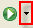
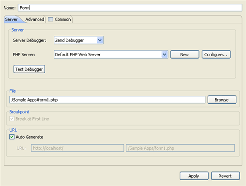

# Running PHP Web Pages

<!--context:running_php_web_pages-->

This procedure describes how to run whole applications, projects, files or collections of files that are on the server. Using this process, you can run either copies of the files which are located on the server or the files located locally on your workspace (if available).

<!--note-start-->

#### Note:

Your server must be running the Xdebug or Zend Debugger in order for remote debugging  capabilities to function.

<!--note-end-->

<!--ref-start-->

To run a PHP Web Page:

 1. Click the arrow next to the Run button  on the toolbar and select Run Configurations -or- go to Run | Run Configurations.  A Run dialog will open.
 2. Double-click the PHP Web Page option to create a new run configuration.  
 3. Enter a name for the new configuration.
 4. Select the Server Debugger to be used . PDT supports both the Zend Debugger and Xdebug.
 5. Select your server from the PHP Server list.  If you have not yet configured your server, click New.  The PHP Server Creation Wizard will open.  Configure your server by following the instructions on '[adding a new server](../../032-reference/032-preferences/080-php_servers.md#Adding_servers)' under the [PHP Servers Preferences](../../032-reference/032-preferences/080-php_servers.md) page.
 6. To check whether your server connection is correctly configured and that PDT can communicate with your server debugger, click the 'Test Debugger' button.
 7. Under PHP File, click Browse and select the file which you would like to run.
 8. The URL to be run will have been automatically created based on the file name and your server address. If the URL does not point to the file's location, unmark the Auto Generate checkbox and modify the URL.

<!--note-start-->

#### Note:

The file to be run needs to exist on the server even if you are going to be selecting to run the local copy of your files.

<!--note-end-->

Click Apply and Run.

Your application will be run and displayed in a browser.

<!--ref-end-->

<!--note-start-->

#### Note:

If the file contains 'include' or 'require' calls to files which are not contained within the project, you must [add them to the project's Include Path](../../024-tasks/168-adding_elements_to_a_project_s_include_path.md) in order to simulate your production environment.  In addition, if a file defined with an absolute path to a server location (See '[Include Paths](../../016-concepts/144-include_paths.md)' for more on absolute file locations) is called, a Path Mapping dialog will appear. See [Path Mapping](../../016-concepts/160-path_mapping.md) for more information.

<!--note-end-->

<!--links-start-->

#### Related Links:

 * [Running](../../016-concepts/120-running.md)
 * [Running Files and Applications](000-index.md)
 * [Running PHP Scripts Locally](008-running_php_scripts_locally.md)
 * [Running PHP Scripts Remotely](016-running_php_scripts_remotely.md)
 * [Using the Debugger](../../024-tasks/152-debugging/000-index.md)
 * [Setting Up Remote Debugging](../../024-tasks/152-debugging/048-troubleshooting_remote_debugging/000-index.md)

<!--links-end-->
