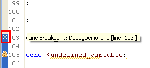
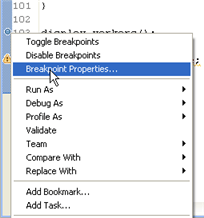
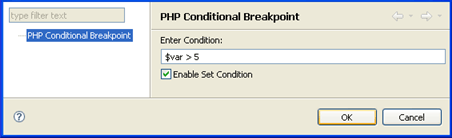
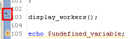

# Setting Breakpoints

<!--context:setting_breakpoints-->

Before you debug your scripts, you can set breakpoints in them to specify places in your code where the debugging process will pause.

These procedures demonstrate how to set line and conditional PHP breakpoints.

<!--ref-start-->

To set a breakpoint in your script:

Double-click the vertical ruler to the left of the line where you want to set the breakpoint -or- select the line and go to Run | Toggle Breakpoint or press Ctrl+Shift+B.HERE
A blue ball will appear, indicating that a breakpoint has been set.

<!--ref-end-->

<!--ref-start-->

To add a condition to a breakpoint:

 1. Right-click the breakpoint in the vertical marker bar and select Breakpoint Properties...   The PHP Conditional Breakpoint dialog opens.
 2. Enter the required condition and ensure the Enable Set Condition checkbox is marked.  
 3. Click OK.

The condition will be set for the breakpoint and the debugging process will pause only if the condition is met.

The breakpoint will be represented by a blue ball with a question mark.

<!--ref-end-->

<!--links-start-->

#### Related Links:

 * [Breakpoints](../../016-concepts/136-breakpoints.md)
 * [Breakpoints View](../../032-reference/008-php_perspectives_and_views/016-php_debug_perspective/024-breakpoints_view.md)
 * [Debugging](../../016-concepts/128-debugging_concept.md)
 * [Running and Analyzing Debugger Results](040-analyzing_debugger_results.md)

<!--links-end-->
