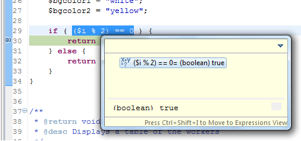

# Using the Inspect Action

<!--context:using_the_inspect_action-->

The Inspect Action is a quick way to evaluate an expression when debugging your PHP script.

<!--ref-start-->

 1. Set a breakpoint to your code by double-clicking the vertical ruler to the left of the line where you want to set the breakpoint -or- select the line and go to **Run | Toggle Breakpoint** or press **Ctrl+Shift+B.HERE**.  A blue ball will appear, indicating that a breakpoint has been set.
 2. Select an expression in the editor and from the Right Click Menu select **Inspect**- or - press **Ctrl+Shirft+I**.  The evaluated expression is shown.  

For more information on Debugging methods see [Debugging](../../016-concepts/128-debugging_concept.md).

<!--ref-end-->

<!--links-start-->

#### Related Links:

 * [Debugging Files and Applications](000-index.md)
 * [Setting Breakpoints](008-setting_breakpoints.md)

<!--links-end-->
