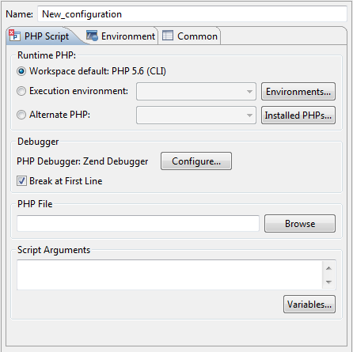

# Locally Debugging a PHP Script

<!--context:locally_debugging_a_php_script-->

This procedure describes how to debug a PHP Script from your workspace using an internal [PHP Executable](../../032-reference/032-preferences/056-php_executables/000-index.md).

<!--note-start-->

#### Note:

You must configure your PHP Executable through the [PHP Executables Preferences page](../../032-reference/032-preferences/056-php_executables/000-index.md) before you can debug locally.

<!--note-end-->

<!--ref-start-->

To locally debug a PHP Script:

 1. Set breakpoints at the relevant places in the file that you would like to debug by double-clicking the vertical marker bar to the left of the editor.
 2. Save the file.
 3. Click the arrow next to the debug button  on the toolbar and select Debug Configurations... -or- select **Run | Debug Configurations....**  A Debug dialog will open.
 4. Double-click the PHP CLI Application option to create a new debug configuration.

 5. Enter a name for the new configuration.
 6. Select the appropriate PHP Executable in **Runtime PHP** section. If no PHP Executables are available, click the **Installed PHPs** button and add a PHP Executable in the [PHP Executable Preferences](../../032-reference/032-preferences/056-php_executables/000-index.md) page.
 7. Enter your PHP file in the "PHP File" text field, or click **Browse** and select your file
 8. Marking the "Break at First Line" checkbox will result in the debugging process pausing at the first line of code.
 9. If necessary, you can add arguments in the Script Arguments section to simulate command line inputs.
 10. Click **Apply** and then **Debug**.
 11. Click **Yes** if asked whether to open the PHP Debug Perspective.

A number of views will open with relevant debug information.

See the [Running and Analyzing Debugger results](040-analyzing_debugger_results.md) topic for more information on the outcome of a debugging process.

<!--ref-end-->

<!--note-start-->

#### Note:

If the file contains 'include' or 'require' calls to files which are not contained within the project, you must [add them to the project's Include Path](../../024-tasks/168-adding_elements_to_a_project_s_include_path.md) in order to simulate your production environment.

<!--note-end-->

<!--links-start-->

#### Related Links:

 * [Working with the Debugger](../../008-getting_started/016-basic_tutorial/024-working_with_the_debugger.md)
 * [Debugging](000-index.md)
 * [Debug Preferences](../../032-reference/032-preferences/032-debug/000-index.md) 
 * [Debugging a PHP Web Page](032-debugging_a_php_web_page.md)
 * [Running and Analyzing Debugger Results](040-analyzing_debugger_results.md)
 * [Run Menu](../../032-reference/016-menus/064-run.md)
 * [PHP Support](../../016-concepts/008-php_support.md)

<!--links-end-->
