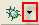
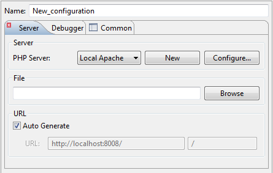
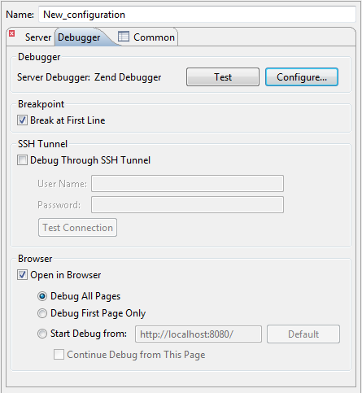

# Debugging a PHP Web Page

<!--context:debugging_a_php_web_page-->

This procedure describes how to debug whole applications, projects, files or collections of files that are already on the server.

<!--note-start-->

#### Note:

Your server must be running the Xdebug or Zend Debugger in order for remote debugging  capabilities to function.

<!--note-end-->

<!--ref-start-->

## To debug a PHP Web Page:

1\. Click the arrow next to the debug button  on the toolbar and select Open Debug Dialog -or- select Run | Open Debug Dialog.  A Debug dialog will open.

2\. Double-click the PHP Web Application option to create a new debug configuration.

 
3\. Enter a name for the new configuration.

4\. Select your server from the PHP Server list.  If you have not yet configured your server, click New.  The PHP Server Creation Wizard will open.  Configure your server by following the instructions on '[adding a new server](../../032-reference/032-preferences/080-php_servers.md#Adding_servers)' under the [PHP Servers Preferences](../../032-reference/032-preferences/080-php_servers.md) page.

5\. Under File, click Browse and select your 'debug target' file (the file from which the debugging process will start.)
 
6\. The URL to be debugged will have been automatically created based on the file name and your server address. If the URL does not point to your debug target's location, unmark the Auto Generate checkbox and modify the URL.

7\. To set up the options of a debugger that is attached to chosen PHP server, click on the **Debugger** tab.

8\. To check whether your server connection is correctly configured, and that PDT can communicate with your server debugger, click the 'Test' button.

9\. Select whether the Debugger should stop at the first line of code by marking/unmarking the 'Break at First Line' checkbox.
 
10\. You can set some additional options that are related to the debugger type, e.g. the following options are available for Zend Debugger:

 * Debug Through SSH Tunnel - Mark if you would like to debug with the use of SSH tunnel.
 * Open in Browser - Mark if you would like the application to be displayed in PDT 's internal browser while it is debugged.
 * Choose whether to:
 * Debug All Pages - The specified page and all the pages linked to it are debugged. The browser waits for the debug of each page before displaying it.
 * Debug First Page Only - Only the first page is debugged.
 * Start Debug from - Select the URL from which you would like the Debugging process to start.
 * Continue Debug from this Page - Selecting this option will result in all the pages linked to the URL being debugged.
 
 11\. Click Apply and then Debug.
 
 12\. Click Yes if asked whether to open the PHP Debug Perspective.

See the "[Running and Analyzing Debugger results](040-analyzing_debugger_results.md)" topic for more information on the outcome of a debugging process.

<!--ref-end-->

<!--note-start-->

#### Note:

Since 7.1 PDT have support for Xdebug stack trace links. To enable this, in your `php.ini` add this line:

    xdebug.file_link_format=xdebug://%f@%l

<!--note-end-->

<!--note-start-->

#### Note:

If the file contains 'include' or 'require' calls to files which are not contained within the project, you must [add them to the project's Include Path](../../024-tasks/168-adding_elements_to_a_project_s_include_path.md) in order to simulate your production environment.  In addition, if a file defined with an absolute path to a server location (See '[Include Paths](../../016-concepts/144-include_paths.md)' for more on absolute file locations) is called, a Path Mapping dialog will appear. See [Path Mapping](../../016-concepts/160-path_mapping.md) for more information.

<!--note-end-->

<!--links-start-->

#### Related Links:

 * [Setting Up Remote Debugging](../../024-tasks/152-debugging/048-troubleshooting_remote_debugging/000-index.md)
 * [Working with the Debugger](../../008-getting_started/016-basic_tutorial/024-working_with_the_debugger.md)
 * [Debugging](000-index.md)
 * [Debug Preferences](../../032-reference/032-preferences/032-debug/000-index.md)
 * [Locally Debugging a PHP Script](024-locally_debugging_a_php_script.md)
 * [Running and Analyzing Debugger Results](040-analyzing_debugger_results.md)

<!--links-end-->
