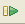
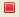
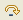
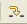
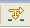
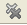

# Running and Analyzing Debugger Results

<!--context:analyzing_debugger_results-->

Once you have launched one of the debug sessions (PHP Script, PHP Web Page or URL), you can control and monitor the debugging process using the views displayed in the debugging process.

Controlling the debugging process:

The debug process can be controlled using the various buttons in the Debug view.

 1. The Debug process will automatically stop at each breakpoint.
 2. The various views will display information about the debugging process up to that point only.
 3. You can use the various buttons in the debug view to decide how to continue with the debugging process:
    * Click the Resume button   to continue the debugging process until the next breakpoint, or until the end of the debugging process.
    * Click the Terminate button  to stop the debugging process.
    * Click the Step Over  button to step over the next method call (without entering it) at the currently executing line of code. The method will still be executed.
    * Click the Step Return button   to return from a method which has been stepped into. The remainder of the code that was skipped by returning is still executed.
    * Click the Step Into button  to step into the next method call at the currently executing line of code.
    * Click the Use Step Filters button  to change whether step filters should be used in the current Debug View.
    * Once the debugging process has terminated, you can click the Remove Terminated Launches button  to remove any terminated debug sessions from the list.

    During the debugging process (for PHP Script, PHP Web Page or URL), various views will provide the following information:
    * [Debug View](../../032-reference/008-php_perspectives_and_views/016-php_debug_perspective/008-debug_view.md)  - Here you can control (stop, pause, and resume) the debugging process. You can also decide whether to step into, step over or step return (step out off) certain functions.
    * [Variables](../../032-reference/008-php_perspectives_and_views/016-php_debug_perspective/016-variables_view.md) - Will display the various variables in your script.
    * [Breakpoints](../../032-reference/008-php_perspectives_and_views/016-php_debug_perspective/024-breakpoints_view.md) - Will display the breakpoints you have entered
    * [Parameter Stack](../../032-reference/008-php_perspectives_and_views/016-php_debug_perspective/032-parameter_stack.md) - Will display the parameters through which functions are reached.
    * Editor Window - Will display the code at the relevant sections, according to which line is selected in the Debug View window.
    * [Debug Output](../../032-reference/008-php_perspectives_and_views/016-php_debug_perspective/048-debug_output_view.md) - Will show the textual output of the script. This will be updated as the debugging process continues.
    * [Browser Output](../../032-reference/008-php_perspectives_and_views/016-php_debug_perspective/056-browser_output_view.md) - Will show the output of the script to a browser. This will be updated as the debugging process continues.
    * [Console View](PLUGINS_ROOT/org.eclipse.jdt.doc.user/reference/views/console/ref-console_view.htm) - Displays any error and warning messages.
    * [Tasks View](PLUGINS_ROOT/org.eclipse.platform.doc.user/concepts/ctskview.htm) - Displays tasks that were added to your script (if applicable).

    During the debugging process (for JavaScript debugging), various views will provide the following information:
    * Debug View [Debug Perspective]  - Here you can control (stop, pause, and resume) the debugging process. You can also decide whether to step into, step over or step return (step out off) certain functions.
    * Variables View [Debug Perspective] - Will display the various variables in your script.
    * Breakpoints View [Debug Perspective] - Will display the breakpoints you have entered.
    * Scripts View - Displays a list of available scripts. Double click a script to see it's code in an editor.
    * Editor Window - Will display the code at the relevant sections, according to which line is selected in the Debug View window.
    * Internal Web Browser - Displays the code you are debugging in the Browser.
    * Debug Output View [Debug Perspective] - Will show the textual output of the script. This will be updated as the debugging process continues.
    * Browser Output View [Debug Perspective] - Will show the output of the script to a browser. This will be updated as the debugging process continues.
    * [Console View](PLUGINS_ROOT/org.eclipse.jdt.doc.user/reference/views/console/ref-console_view.htm) - Displays any error and warning messages.
    * [Tasks View](PLUGINS_ROOT/org.eclipse.platform.doc.user/concepts/ctskview.htm) - Displays tasks that were added to your script (if applicable).

<!--note-start-->

#### Note:

See '[PHP Debug Perspective](../../032-reference/008-php_perspectives_and_views/016-php_debug_perspective/000-index.md)' for more on the views that will be displayed during Debugging.

<!--note-end-->

<!--links-start-->

#### Related Links:

 * [PHP Debug Perspective](../../032-reference/008-php_perspectives_and_views/016-php_debug_perspective/000-index.md)
 * [Working with the Debugger](../../008-getting_started/016-basic_tutorial/024-working_with_the_debugger.md)
 * [Debugging](000-index.md)
 * [Debugging a PHP Web Page](032-debugging_a_php_web_page.md)
 * [Debug Preferences](../../032-reference/032-preferences/032-debug/000-index.md)

<!--links-end-->
