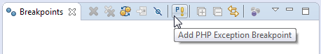
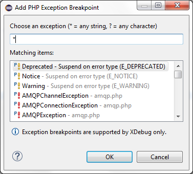
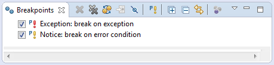

# Setting Exception Breakpoints

<!--context:setting_exception_breakpoints-->

**NOTE:** Exception breakpoints are supported by **XDebug** only. 

Before executing your scripts, you can set exception breakpoints to specify exception types or error conditions on which the debugging process will pause.

Below you can find a step by step instruction that demonstrates how to set exception breakpoints:

<!--ref-start-->

1\. Open **Breakpoints** view and run **Add PHP Exception Breakpoint** command available in view toolbar;

2\. Select the exception or error types in the **Add PHP Exception Breakpoint** dialog and press **OK** to add the chosen exception breakpoints;
 

Chosen exception breakpoints should be visible in the list of available breakpoints in the **Breakpoints** view.

<!--ref-end-->

<!--links-start-->

#### Related Links:

 * [Exception Breakpoints](../../016-concepts/192-exception_breakpoints.md)
 * [Breakpoints View](../../032-reference/008-php_perspectives_and_views/016-php_debug_perspective/024-breakpoints_view.md)
 * [Debugging](../../016-concepts/128-debugging_concept.md)
 * [Running and Analyzing Debugger Results](040-analyzing_debugger_results.md)

<!--links-end-->
