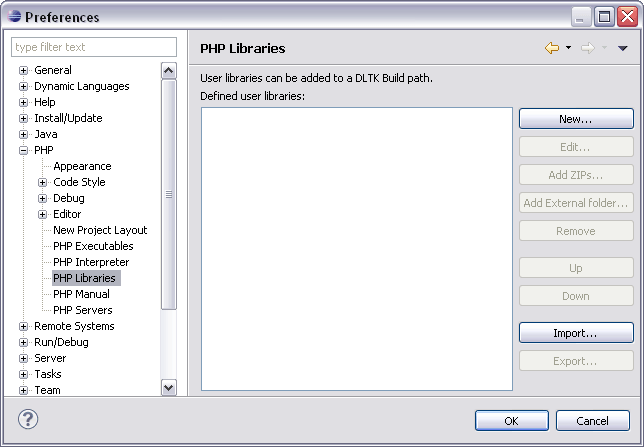

# PHP Libraries Preferences

<!--context:php_libraries_preferences-->

The PHP Libraries Preferences page allows you to create and maintain an external code library.

Enabling PHP Libraries in your project allows libraries to be referenced by the project and makes the elements within these resources available for operations such as Content Assist and Refactoring.

<!--note-start-->

#### Note:

You may change the order your user libraries are in by using the **Up** and **Down**buttons. The order in which the libraries are arranged in this page defines the order they are available in PDT 's functionality, such as content assist.

<!--note-end-->

### The PHP Libraries Preferences page allows you to do the following:

 * [Add PHP Libraries](008-adding_a_php_library.md)
 * [Add External Folders to PHP Libraries](016-adding_external_folders_to_php_libraries.md)
 * [Export PHP User Libraries](032-exporting_php_user_libraries.md)
 * [Import PHP User Libraries](024-importing_php_user_libraries.md)
 * [Edit PHP User Libraries](048-editing_php_user_libraries.md)
 * [Edit PHP Library Components or Folders](040-editing_php_library_components_or_folders.md)
 * [Remove a PHP Library or Library Folder](056-removing_a_php_library_or_library_folder.md)

The PHP Libraries Preferences page is accessed from **Window** | **Preferences** | **PHP**| **PHP** **Libraries**.

<!--note-start-->

#### Note:

Once you have added a user library in the PHP preferences page, you must also add it to your PHP Include Path of the project in which you would like to have it available. For more information see [Configuring a Project's PHP Include Path](../../024-tasks/168-adding_elements_to_a_project_s_include_path.md).

<!--note-end-->

<!--links-start-->

#### Related Links:

 * [Adding a PHP Library](008-adding_a_php_library.md)
 * [Adding External Folders to PHP Libraries](016-adding_external_folders_to_php_libraries.md)
 * [Exporting PHP User Libraries](032-exporting_php_user_libraries.md)
 * [Importing PHP User Libraries](024-importing_php_user_libraries.md)
 * [Editing PHP User Libraries](048-editing_php_user_libraries.md)
 * [Editing PHP Library Components or Folders](040-editing_php_library_components_or_folders.md)
 * [Removing a PHP Library or Library Folder](056-removing_a_php_library_or_library_folder.md)

<!--links-end-->
