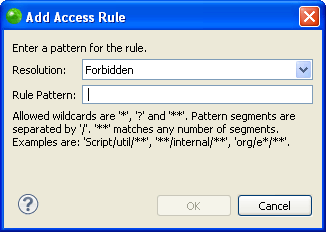

# Adding External Folders to PHP Libraries

<!--context:adding_external_folders_to_php_libraries-->

This procedure describes how to add external folders to a user library. This allows you to compile a user library using folders from varying places on your computer. In order to add an external folder, you must have already created a user library. For more information see [Adding a PHP Library](008-adding_a_php_library.md).

If you are interested in using compressed files, click the **Add ZIPs....** button and select a file instead of following the procedure below.

<!--ref-start-->

**To add an external folder to your user library:**

 1. Go to **Window**| **Preferences** | **PHP** | **PHP Libraries**.
 2. In the PHP Libraries Preferences page click **Add External folder...**  The "External folder Selection" dialog will open.
 3. Select a folder in the "External folder Selection" dialog or create a new folder by clicking **Make New Folder**.
 4. To apply changes click **OK**.

The folder will be added to the PHP library.

The folders that are included in the user defined libraries allow you to control their access rules. The access rule default setting is "No restrictions." See [Defining Access Rules](#Defining Access Rules) below for more information.

<!--ref-end-->

### Defining Access Rules

This procedure describes how to define access rules. Access rules allow you to control where your libraries will be available. From here you can control what code completion options will be available in features such as Content Assist on a project level.

In order to define access rules you must have an external PHP folder added to your project. For more information [Adding External Folders to PHP Libraries](016-adding_external_folders_to_php_libraries.md).

<!--ref-start-->

**To define an access rule for your user defined library:**

 1. Go to **Window**| **Preferences** | **PHP** | **PHP Libraries**.
 2. In the PHP Libraries Preferences page, double click  "Access rules:" located in the hierarchal tree below your added folder. The default setting is "No restrictions."  The "Type Access Rules" dialog will open.
 3. Click **Add...**  The "Add Access Rule" dialog will open.  
 4. From the "Resolution:" drop down menu select one of the following:
    * Forbidden  - This will make the file completely unaccessible in the relevant project.
    * Discouraged - This will make the file  available but not highly suggested.
    * Accessible - This will allow the project to access the file and its contents freely.
 5. In the "Rule Pattern" field, insert a rule pattern to define a pattern for the rule. Use wildcards to create a pattern. The accepted wildcard values are:
    * '*'
    * '**'
    * '?'

This will automatically apply the rule to any of the files that match the pattern.

To apply changes click **OK**.

In the "Type Access Rules" dialog, you also have the option to edit, remove, or change the order of your defined access rules by clicking the buttons. Before a file is allowed access into your project, it will first confirm that none of the access rules apply to it. These rules are checked in the order they are placed here.
Your PHP Library now has an access rule defined in the hierarchal tree in the PHP Libraries Preferences page. You may edit a file's access rule at any time by repeating this procedure.

<!--ref-end-->

<!--links-start-->

#### Related Links:

 * [PHP Libraries Preferences](000-index.md)
 * [Adding a PHP Library](008-adding_a_php_library.md)
 * [Exporting PHP User Libraries](032-exporting_php_user_libraries.md)
 * [Importing PHP User Libraries](024-importing_php_user_libraries.md)
 * [Editing PHP User Libraries](048-editing_php_user_libraries.md)
 * [Editing PHP Library Components or Folders](040-editing_php_library_components_or_folders.md)
 * [Removing a PHP Library or Library Folder](056-removing_a_php_library_or_library_folder.md)

<!--links-end-->
