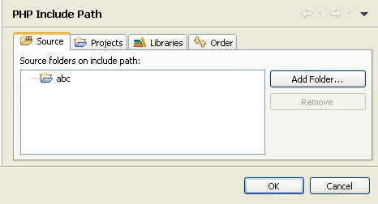

# Configuring a Project's PHP Include Path

<!--context:adding_elements_to_a_project_s_include_path-->

Adding external resources to a project's include path makes resources outside the project available for operations such as debugging and content assist. See [PHP Include Paths](../016-concepts/144-include_paths.md) for more information.

This procedure describes how to configure your project's Include Path.

<!--ref-start-->

To configure your project's Include Path:

1. In Project Explorer view, right-click the required project and select **Include Path |  Configure Include Path...**   -Or- right-click the project and select **Properties | Include Path**.The project's PHP Include Path properties page will appear.  
   
  From this page you can configure the following:
     * To configure source folders on your Include Path:
        1. Select the Source tab.  By default, all folders which are on your Include Path will be added to your [Build Path](../016-concepts/152-build_paths.md).
         ** Note:** If your project root is on your Include Path, all folders and resources contained within your project will also be on the Include Path. To add only certain folders, remove the project root from the Include Path and add only the required folders.
        2. To remove a folder, select it and click **Remove**.
        3. To add a folder from your project, click the **Add Folder** button and select the required folder.  A prompt will display, asking whether you would also like to add the selected folder(s) to your [Build Path](../016-concepts/152-build_paths.md).  It is recommended that the resources on your Build Path match the resources on your Include Path.  Click **Yes** to add the folder(s) to your Build Path or **No**for your Build Path to not be affected.
     * To add another project from your workspace to your Include Path:
        1. Select the "Projects tab".
        2. Click **Add**.  The Required Project Selection dialog appears.
        3. Select the projects you would like to add and click **OK**.  The selected project(s) will be added to your project's Include Path.
     * To add a library to your Include Path:
        1. Select the "Libraries tab".
        2. Click **Add Library**.  The Add Library dialog appears.
        3. Select the required Library (if available) and click **OK**.
     * To add external folders to your Include Path:
        1. Select the "Libraries tab".
        2. Click **Add**External Folder.  The Add Include Path dialog appears.
        3. Browse to and select the required folder.
        4. Click **OK**.  The folder will be added to your project's Include Path.
         **Note:**
        The library is a read-only file and will not be available for editing.
     * To configure the order of elements on your Include Path:
        1. Select the "Order tab". This determines the order in which resources will be searched for in require/include calls.  See [Include Paths](../016-concepts/144-include_paths.md) for more information on the order for which files are searched for.  If applicable, it is recommended that elements appear in the same order as they do in your php.ini.
        2. If necessary, rearrange the order of the entries. To do so, select an element and click **Up** or **Down** to move it in the list.
2. Once all the elements are added and are in the right order, click **OK**.

All the selected elements will be added to the project's include path.

<!--ref-end-->

<!--links-start-->

#### Related Links:

 * [PHP Include Paths](../016-concepts/144-include_paths.md)
 * [PHP Build Path](../016-concepts/152-build_paths.md)

<!--links-end-->
